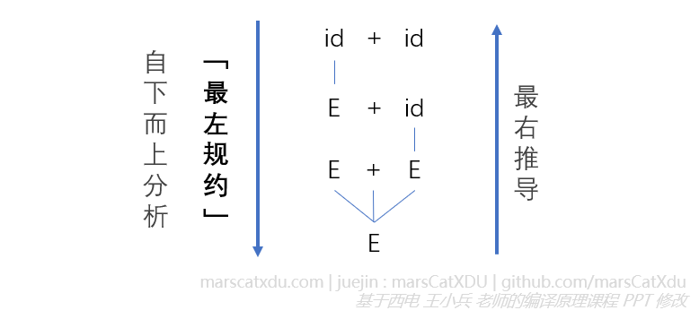

# 编译原理笔记14：自下而上语法分析（1）

## 基本方法

从句子 ω 开始，从左到右扫描 ω，反复用产生式的左部替换产生式的右部、谋求对 ω 的匹配，最终得到文法的开始符号（或，发现错误）（也就是从下往上搞出个树，最后推到根也就是开始符号了）

在分析的过程中，每一步都总是尝试在句型中寻找一个能够被替换为产生式左部的子串。就这样一步步向上去替换，最终变成一个开始符号。

而，由于我们对记号流的扫描是从左到右的，故我们【尝试寻找句型中能够被替换为产生式左部的子串，并不断进行替换】的过程也是从左到右的。这样从记号到开始符号一步进行自下而上分析的逆过程其实就是一个最右推导！

推导的逆过程，就叫做【规约】。最右推导的逆过程，就是最左规约。

### 规范规约 & 剪句柄

最右推导叫做【规范推导】，因此作为其逆过程的最左规约，也就是【规范规约】了

##### 短语、直接短语和句柄

设 αβδ 是文法 G 的一个句型，若存在 S =*> αAδ ， A =+> β，则称 β 是句型 αβδ 相对于 A 的【短语】。若 A→β ，则称 β 是句型 αβδ 相对于产生式 A→β 的【直接短语】。一个句型的最左直接短语被称为【句柄】。

句型，是一个完整的结构，短语则是句型中针对某非终结符的局部。因此，开始符号 S 是句型而不是短语。

短语形成的要素：

- S 可推导出 A，即 S=*> αAδ ；
- 从 A 开始经过至少一次推导推出 β，即 A=+> β。

**我个人认为（俺寻思）**：进行规约的一大关键点，是怎么在一堆本质上是字符串的符号流中，试图搞明白 “这tm到底哪几个连在一块的字符算一个符号啊？这到底几个符号连起来能和哪个产生式的右部匹配上啊？” 的问题。而这里的【短语】、【直接短语】、【句柄】概念，其实就是**描述产生式右部的组合及边界**的方案——回想自然语言中的 “短语”，自然语言中的短语是指由至少两个单词构成的、有序组合起来共同表达某一个含义的有序单词序列——只有特定的单词以特定的顺序组成序列才能被称为**一个**短语。那么语法分析中的短语也是一样的：语法分析中的短语是指由至少数个终结符或(和)非终结符构成的、有序组合起来的符号序列，这个序列就是某个产生式的右部，也就可以在规约时被规约为一个产生式的左部。

反映在上面定义的例子中，就是：

- β 是句型 αβδ 相对于 A 的【短语】，那么 αβδ 就可以经过至少一步规约后规约为 αAδ 。而 αAδ 则能够在经过零或多步规约后，最终规约为开始符号 S；
-  β 是句型 αβδ 相对于产生式 A→β 的【直接短语】，那么 αβδ 就可以在经过一步规约后成为  αAδ ；
- 句柄？~~操！最左直接短语！妈的，有的时候最左边的单嘣一个终结符， tm 就没有给他老哥一个单独准备的右部就他一个的产生式，没办法往上规约啊！所以这时候他就不能算句柄了，得是紧贴着他的下一个（有潜力的）直接短语才能算句柄啊！！进行最左规约的时候，不是看到右部就换成左部了的。~~前面写的这个思路基本上是剪句柄。。。

- 短语：以非终结符为根子树中所有从左到右的叶子
- 直接短语：只有父子关系的树中所有从左到右排列的叶子（树高为2）
- 句柄：最左边父子关系树中所有从左到右排列的叶子（句柄是唯一的）