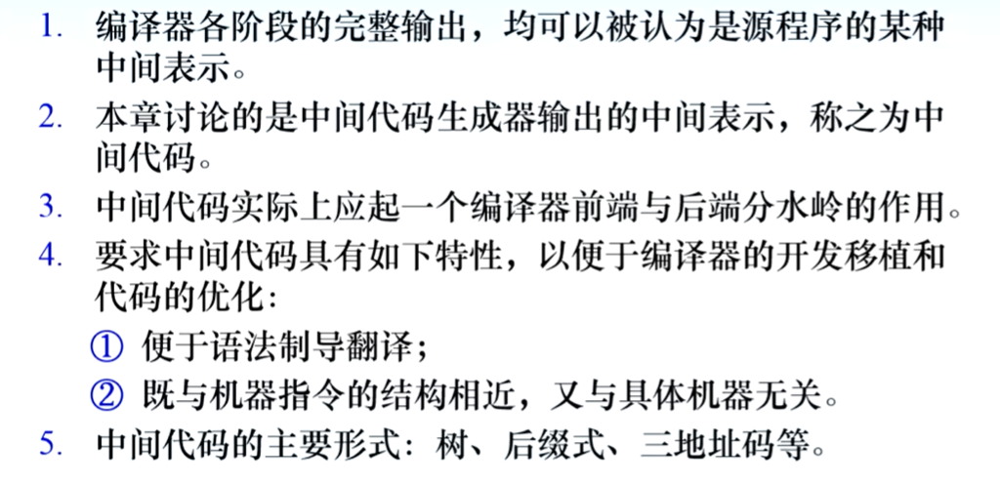

# 编译原理笔记18：语法制导翻译（1）

> **语法制导翻译生成中间代码**

## 语法和语义

语法：语言的结构（即语言的样子）

语义：语言的意义

- 语义不能离开语法而存在
- 同一语言结构可含多种含义，不同的语言结构也可以表达相同含义
- 语法和语义没有明确的界限

语义分析的两个作用：

- 检查结构正确的句子表达的意思是否合法
- 执行规定的语义动作，如：
  - 表达式求值
  - 符号表填写
  - 中间代码生成等
- 语义分析的方法：语法制导翻译（将语法结构翻译为中间代码或直接执行）

属性与语义规则

比如对 x = y + z，实际上是 id = id + id，符号也是有属性的如 name 和 address 和 type。

语义通过函数执行，函数执行的动作由设计者定义。这样的动作被称作“语义规则”

单个符号的意义蕴含在【属性】中，数个符号构成的整体结构则需要根据语义规则确定

语法制导翻译的基本思想：以语法分析为基础，伴随语法分析的各个步骤，执行相应的语义动作

#### 具体方法：

1. 将文法符号所代表的语言结构的意思，用附着于该文法符号的**属性**表示
2. 用语义规则规定产生式所代表的语言结构之间的关系（属性和属性之间的关系），即用语义规则实现属性的计算

语义规则的执行：在语法分析的适当时刻（如推导或规约）执行附着在对应产生式上的语义规则，以实现对语言结构语义的处理，如计算、查填符号表、生成中间代码、发布出错信息等（自下而上的分析中，一般在规约时执行语义规则）

#### 属性的抽象表示

.attr

如 E.val ，E.type，E.code，E.place ，分别代表值、类型、代码序列、存储空间

接下来的所有讨论都默认基于二义文法进行，默认已经通过定义的方式解决了优先级和结合性（像是在 yacc 里面直接写上的那种）

属性的定义：

> 对于产生式 A → α，α 是由文法符号 X1X2...Xn 组成的序列，其语义规则可表示为下面这个关于属性的函数： b := f(c1, c2, ..., ck)

这里用函数表示语义之间的关系。

- 属性分为综合属性和继承属性

  - 如果 b 是 A 的属性， c1~ck 为 α 中符号的属性或 A 的其他属性，则 b 为 A 的**综合属性**，适合于自下而上分析
  - 若 b 是 α 中某文法符号 Xi 的属性，c1~ck 是 A 的属性，则 b 是 Xi 的**继承属性**，适合于自上而下分析
  - 称 属性 b 依赖于 属性 c1~ck
  - 若语义规则符合 f(c1, c2, ..., ck)，则可将其想象为产生式左部符号 A 的一个**虚拟属性**。属性之间的依赖关系在虚拟属性上也存在

  属性的依赖关系，实际上反映了属性计算的先后次序。即所有属性 ci 被计算后才能计算 b

例：将中缀形式的算术表达式转换为后缀表示。其语法制导定义和翻译方案可分别定义如下。其中 print(E.post) 是 L 的虚拟属性，可以想象为 L.p := print(E.post)。翻译方案中的 .lexval 表示词法分析返回的记号 num 的值

语法制导定义是算法，翻译方案的程序实现不唯一

LR 分析翻译方案设计

- LR 分析中的语法制导翻译实际上是对 LR 语法分析的扩充

  1. 扩充 LR 分析器的功能：当执行规约产生式的动作时，也执行相应的语义动作。由于是规约时执行语义动作，限制语义动作仅能放在产生式右部的最右边；
  2. 扩充分析栈，增加一个与分析栈并列的语义栈，用于存放栈中文法符号所对应的属性值

  

  

语法分析同时进行语法制导翻译，语法分析结束，值也就算出来了

因为不关心加号是什么含义，所以语义栈中加号的位置就没有值，用一个问号表示

## 中间代码简介

中间代码有后缀式、三地址码、树表示的中间代码三种。这三种中间代码表示可以相互转换

### 后缀式

### 三地址码

三地址码的具体写法：三元式、四元式

三元式实际上还是四元式，前面的序号意味着“把三元式的结果放到序号的位置去”，不光是表示其是第几条，还是要保存一个值的

比如这个，前面的序号就相当于存了一个值，说明括号内运算的结果放在该序号中

### 树表示的中间代码

## 符号表

符号表是连接声明与引用的桥梁，记住每个符号的相关信息（如作用域、绑定），帮助编译的各个阶段正确有效地工作。（用语义的方法解决语法无法描述的结构）

符号表设计的基本要求：合理存放信息、快速准确查找

- 符号表中的每一条称为一个条目，每个声明的名字在符号表中占据一栏，存放名字和相关信息
- 内容有保留字、标识符、特殊符号（算符、分隔符等）
- 不同符号可以放在不同子表中，如变量名表、过程名表、保留字表

## 声明语句的翻译

这里