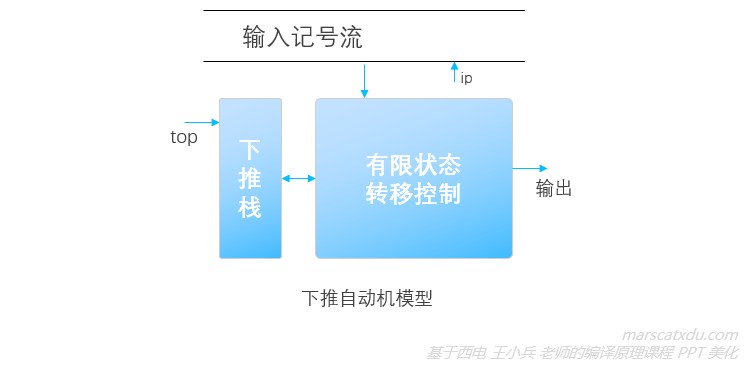
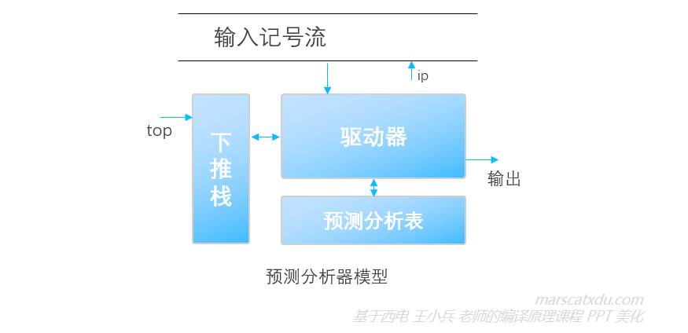

# 编译原理笔记11：自上而下语法分析（1）

词法分析，是把源程序分析成记号流，识别其中的单词。

语法分析，是要分析词法分析产生的记号流中的语法结构是否正确——对词法分析得到的记号流进行分析，以确认其是不是一个可以由我们定义好的文法推出来的句子。如果语法结构正确，语法分析器最终要为输入序列构造出一棵语法树。

在推导的过程中，我们其实会同时保有两个序列：一个是词法分析器给的输入序列，另一个则是我们自己推导的序列。如果最后两个序列都能够一一匹配上，那么就说明输入序列是符合语法规则的，我们构造出的就是合法的语法树。

语法分析有两种方式，分别是自上而下分析和自下而上的分析。我们在此仅对前者进行简单的学习，重点都放在后者上（各种略……精力实在不够，写不动了）。

自上而下分析有两种方式：【递归下降分析】和【使用预测分析器的预测分析】。无论是哪种，都对文法有一些要求——**文法不能有二义性，产生式不能有左递归，也不能有公共左因子**。

## 自上而下分析的一般方法

### 用推导的方法分析输入序列

词法分析器给我们的记号流，在这里被称为【输入序列】。我们使用**边推导边匹配**的方法对它进行分析，该方法描述如下：

1. 对输入序列 ω，从 S 开始进行**最左推导**，直到得到一个合法句子或非法结构。（因为对输入序列的扫描是从左到右的，所以我们的推导也要从左到右进行。在推导的过程中，也总是尝试推导出最左端的终结符，以将其和输入序列中的最左边的记号进行匹配）
2. 从左到右扫描输入序列，自上而下构造这个序列的分析树；
3. 通过推导分析输入序列的过程是一个反复试探的过程，这个过程中会不断尝试使用不同的产生式，尝试让推导与输入序列相匹配。

用推导分析输入序列的过程中，会由于文法产生式的某些“特征”而遇到如下的两个问题，导致推导过程的回溯。

#### 左递归问题及其消除（消除左递归）

左递归产生式形如： `A → Aa`

左递归会导致分析陷入死循环：我们可以总用 Aa 来替换掉上一层的 Aa 中的 A，无法停下来。想要避免死循环的出现，我们就需要**消除左递归**。

##### 消除直接左递归

暂略

##### 消除间接左递归

暂略

#### 公共左因子问题及其消除（提取左因子）

存在公共左因子的产生式形如：`A → αβ1|αβ2`

公共左因子会造成不必要的回溯——因为通过推导来分析输入序列是一个反复试探的过程，既然是试探那么就会出现试错了的情况，而显然，公共左因子的存在，就为“试错了”的出现创造了条件。

回溯会出现严重的浪费，所以我们其实可以像解决词法分析的回溯问题一样（有限自动机的确定化），通过将推导“确定化”来避免回溯的产生。具体的方式就是**提取左因子**。

##### 提取左因子

暂略

## 递归下降分析

略

## 使用预测分析器的自上而下分析

使用预测分析器进行的自上而下分析是非递归的。预测分析器模型其实是一种 PDA（下推自动机，Pushdown Definite Automata），其结构如下图所示

上图中的“有限状态转移控制”类似于词法分析中的自动机。下推自动机在单纯的自动机旁增加了一个**下推栈**。将该模型进一步具体化，即得到**预测分析器模型**，如下图所示。

这里的“驱动器”，是一个能够控制读写头读取输入记号流中记号的算法，该算法要综合读到的记号、下推栈情况和预测分析表的内容，来修改符号栈和控制输出。

PDA 可以识别形如 ：ωcωr 的串，这样的串是 DFA 无法识别的，这类串也无法使用正规式进行描述。（ps. ωr 的意思是终结符序列 ω 的反转形式，比如 <u>abab</u>c<u>baba</u>）。而对于形如 CSG 那种的 ωcω 串，则 PDA 也无法进行识别。

预测分析器通过【格局与格局的变换】进行分析。

#### 格局

格局是一个三元组 `(栈顶元素^top，剩余输入^ip，改变格局的动作)`，改变格局的动作通过查表确定，具体动作包括：展开非终结符、匹配终结符、报告分析成功（^top=^ip=#）、报告出错（遇到上述情况之外的其他情况，要调用错误恢复例程）

我们可以将预测分析器看作一个逐步运行（Step）的机器，每一个 step 都会让预测分析器到达一个新的 **格局** ，直到到达接收格局为止（或者到达出错格局，即发现语法错误。比如推出来的终结符和读写头读到的终结符不一样，或者栈顶和读写头当前指向的终结符所对应的预测分析表元素为空）

