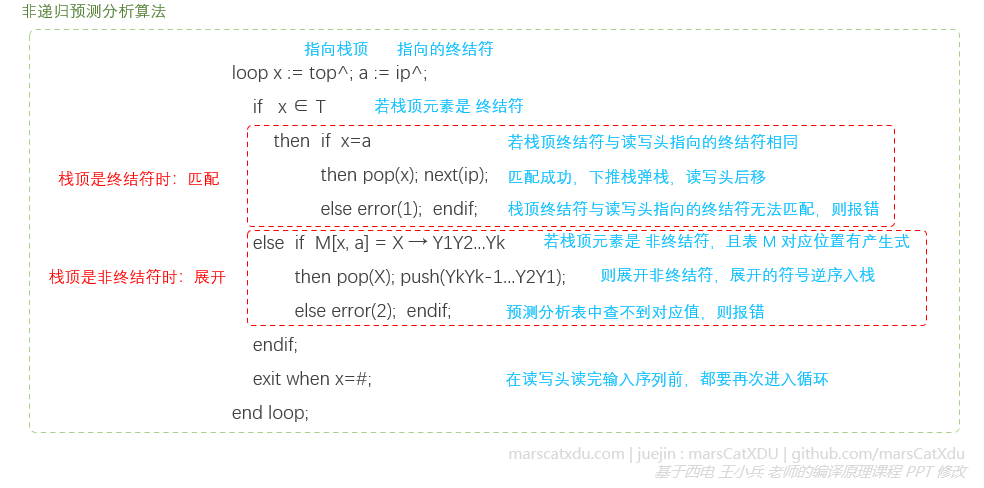
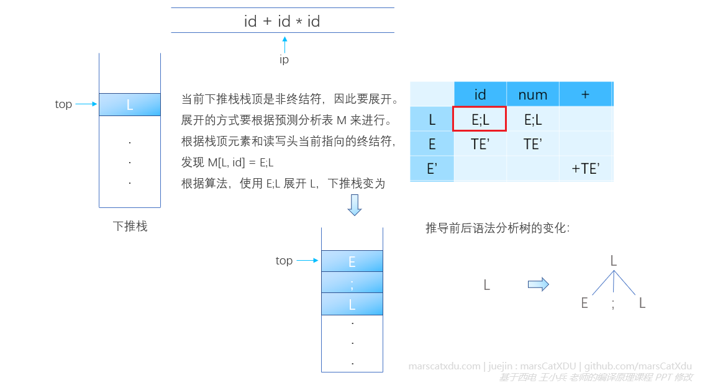

# 编译原理笔记12：自上而下语法分析（2）非递归预测分析器、FIRST & FOLLOW 集合计算

#### 使用预测分析器进行分析的实例

预测分析器需要借助预测分析表来构造语法分析树。

在进行语法分析时，预测分析器根据符号栈（下推栈）栈顶元素和驱动器读写头指向的记号流中的记号来查询预测分析表，根据预测分析表中对应项的情况来决定下一步的操作。预测分析表形式如下：


预测分析表的行首是非终结符，列首是终结符。

- **当栈顶是非终结符时，展开**：需要根据预测分析表查到候选项，然后使用该候选项来展开栈顶的非终结符——弹出栈顶非终结符，将表中的对应项逆序压入到下推栈中（注意顺序，产生式右部是反着压进去的，因为总要保持从左到右推导）。
- **当栈顶时终结符时，匹配**：若此时栈顶的终结符与驱动器读写头读到的终结符相同，则将该栈顶元素弹出，同时读写头向后移动一个记号。


对于消除了左递归和公共左因子的如下 CFG，我们可以根据其来构造一个预测分析表（具体构造方式留到后面再说）

```
T → E;L|ε
E → TE'
E' → +TE'|-TE'|ε
T → FT'
T' → *FT'|/FT'|mod FT'|ε
F → (E)|id|num
```


我们根据如下算法，来进行非递归预测分析



其实，就是重复进行这样的操作：根据读写头指向的终结符、栈顶元素查预测分析表，不断把表中查到的元素压入栈顶。因为是从开始符号开始推导的，所以栈中会出现【根据预测分析表查到新的非终结符入栈】的情况。如果推导时栈顶是非终结符，则读写头不需要移动，一直指向之前停下的位置。但随着推导的进行，非终结符终究会推出终结符（这个终结符也要和前面非终结符一样，被压入栈），如果这个推导出来的、当前正好在下推栈栈顶的终结符和读写头指向的符号相同，那么就是【匹配上了】

下图说明了【栈顶是非终结符时，进行展开】的过程，执行非递归预测算法插图中的第二个红色虚线框内的代码：



下图同时说明了【栈顶是非终结符时，进行展开】和【栈顶是终结符时，进行匹配】的过程。对于后一个过程，执行非递归预测算法插图中的第一个红色虚线框内的代码：


## 预测分析表的构造

哦，预测分析器真是个好东西，预测分析表也真棒。那么问题来了，预测分析表要从哪里来？

当然是自己想办法构造出来……

构造过程简单来说就是先根据一堆的产生式构造 FIRST、FOLLOW 集合，然后再根据这两个集合来构造预测分析表。

因此，FIRST、FOLLOW 集合的构造是这里的重中之重。

我们根据下面的块中的产生式来学习这两个集合

<div>
    <div style="border-style: dashed; 
        border-radius:5px; 
        padding:15px; 
        margin:3px 5px 8px 5px; 
        border-width: 1px; 
        border-color: grey">
        L  → E;L | ε<br>
E  → TE'<br>
E' → +TE' | -TE' | ε<br>
T  → FT'<br>
T' → *FT' | /FT' | mod FT' | ε<br>
F  → (E) | id | num<br>
        </div>
</div>

### FIRST 集合

> 文法符号序列 α 的 FIRST 集合为：
> FIRST(α) = { a | α=\*> a...，a ∈ T }，若 α=\*>ε ，则 ε ∈ FIRST(α)

说白了，FIRST(α) 就是 α 能推出来的所有串（aka. 文法符号序列）中的第一个终结符的集合。

我们以产生式 F → (E)|id|num 为例。
假设读写头和下推栈的情况如下图所示：


因为 F → (E) | id | num，而栈顶又恰好是 F，因此此时读写头对应的 ? 只有可能是：“( 、id、num” 三者中的一个。

因此，根据 FIRST 的定义，我们有： FIRST(F) = { (, id, num }

非终结符 F 在后面推导的过程中肯定是要被展开的。而根据已知的产生式，F 只能展开为终结符，而这个 F 展开得到的终结符是要去匹配读写头对着的终结符的，因此读写头正指向的 ? 的位置一定是 F 能推出的终结符之一！（否则就匹配不上，会出错）

有了这个集合，我们就可以用它来做预测分析表的 F 行了


### FOLLOW 集合

若某个非终结符的 FIRST 能够穿透，则我们需要考虑这个非终结符的 FOLLOW 集合

> 非终结符 A 的 FOLLOW 集合如下：
>FOLLOW(A) = { a | S=*> ...Aa...，a∈T }，若 A 是某句型的最右符号，则 #∈FOLLOW(A)

说白了，就是从开始符号可以导出的所有含 A 的文法符号序列中 A 之后的终结符。

举个例子的话大概是：FOLLOW(A) 是终结符的集合，从开始符号开始，经过多步推导得到的句型中有【Aa】，则FOLLOW集合中的元素就是这些 a

这次以产生式 F → (E)|id|num | ε 为例。易证： FIRST(F) = { (, id, num, ε }