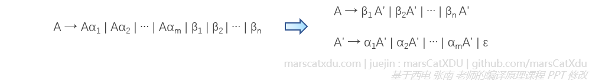
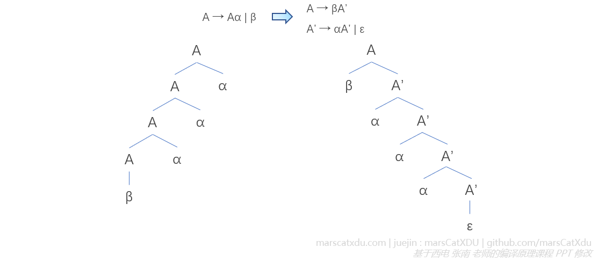

# 编译原理笔记11：自上而下语法分析（1）基础概念、左递归和公共左因子处理、递归下降分析（咕咕咕）

词法分析，是把源程序分析成记号流，识别其中的单词。

语法分析，是要分析词法分析产生的记号流中的语法结构是否正确——对词法分析得到的记号流进行分析，以确认其是不是一个可以由我们定义好的文法推出来的句子。如果语法结构正确，语法分析器最终要为输入序列构造出一棵语法树。

在推导的过程中，我们其实会同时保有两个序列：一个是词法分析器给的输入序列，另一个则是我们自己推导的序列。如果最后两个序列都能够一一匹配上，那么就说明输入序列是符合语法规则的，我们构造出的就是合法的语法树。

语法分析有两种方式，分别是自上而下分析和自下而上的分析。我们在此仅对前者进行简单的学习，重点都放在后者上（各种略……精力实在不够，写不动了）。

自上而下分析有两种方式：【递归下降分析】和【使用预测分析器的预测分析】。无论是哪种，都对文法有一些要求——**文法不能有二义性，产生式不能有左递归，也不能有公共左因子**。


## 自上而下分析的一般方法

### 用推导的方法分析输入序列

词法分析器给我们的记号流，在这里被称为【输入序列】。我们使用**边推导边匹配**的方法对它进行分析，该方法描述如下：

1. 对输入序列 ω，从 S 开始进行**最左推导**，直到得到一个合法句子或非法结构。（因为对输入序列的扫描是从左到右的，所以我们的推导也要从左到右进行。在推导的过程中，也总是尝试推导出最左端的终结符，以将其和输入序列中的最左边的记号进行匹配）
2. 从左到右扫描输入序列，自上而下构造这个序列的分析树；
3. 通过推导分析输入序列的过程是一个反复试探的过程，这个过程中会不断尝试使用不同的产生式，尝试让推导与输入序列相匹配。

用推导分析输入序列的过程中，会由于文法产生式的某些“特征”而遇到如下的两个问题，导致推导过程的回溯。

### 左递归问题及其消除（消除左递归）

左递归产生式形如： `A → Aa`

左递归会导致分析陷入死循环：我们可以总用 Aa 来替换掉上一层的 Aa 中的 A，无法停下来。想要避免死循环的出现，我们就需要**消除左递归**。

#### 消除直接左递归

我们通过引入新的非终结符来消除左递归。

给出一般的左递归产生式如下图左侧，要消除该产生式的左递归，只需要将其改写为下图右侧的两个产生式即可。下图产生式中，α<sub>1</sub> 非空， β<sub>j</sub> 均不以 A 开始（即不包含左递归）



在修改之前的文法中，总是需要靠这些 β 来终止对 A 的推导，即通过 β 出现在最左端的方式来停止递归。所以现在推出来的序列，一定也要是以 β 们开头的序列，β后面链接新的终结符。由A‘ 推出后面可以重复出现的 α 们。最后再为新增的非终结符加一个 ε 推导的选项，用于最终停止递归推导

下图展示一个简单的左递归产生式改写，及改写产生式在语法分析树上的体现



#### 消除间接左递归

对于一般情况的核心步骤：

1. 对各个在产生式左部的非终结符进行排序：A1, A2 ... An（【合理排序】，自己看着办，排序方法不唯一）
2. 用 Aj → δ1 | δ2 |... | δk 的右部替换 Ai → Ajγ 中的 Aj（也就是将一个非终结符在另一个产生式的非终结符中展开），得到 Ai → δ1γ | δ2γ |...| δkγ

例：消除下面文法中的左递归

```
S → Aa | b
A → Ac | Sd | ε
```

这里存在两个左递归：A的直接左递归和 S 的间接左递归

消除这样的左递归分两步走：

1. 要**把不含有直接左递归的非终结符排在前面，含有直接左递归的N排在后面**。因此这里以 S、A 顺序来处理。先把 S 展开到 A 里面，这么一搞，以后就没办法推回来 S 了。这样我们就只留下了一个A

   ```
   A → Ac | Aad | bd | ε
   ```

2. 我们把S干掉了，也就已经消除了 S 的间接左递归，接下来腾出手单独处理 A 。按照标准的直接左递归消除方式来处理现在的情况即可，和之前的抽象题型一样了

   ```
   S → Aa | b
   A → bdA' | A'
   A' → cA' | adA' | ε
   ```

#### 左递归消除算法

暂略，随缘补


### 公共左因子问题及其消除（提取左因子）

存在公共左因子的产生式形如：`A → αβ1|αβ2`

公共左因子会造成不必要的回溯——因为通过推导来分析输入序列是一个反复试探的过程，既然是试探那么就会出现试错了的情况，而显然，公共左因子的存在，就为“试错了”的出现创造了条件。

回溯会出现严重的浪费，所以我们其实可以像解决词法分析的回溯问题一样（有限自动机的确定化），通过将推导“确定化”来避免回溯的产生。具体的方式就是**提取左因子**。

#### 提取左因子

重复以下过程，直到所有 A 产生式中都不再含有公共前缀：

1. 重排 A 产生式：A → αβ<sub>1</sub> | αβ<sub>2</sub> |... | αβ<sub>n</sub>| γ
2. 用 A → αA' | γ 和 A' → β<sub>1</sub> | β<sub>2</sub> | ... | β<sub>n</sub> 取代原 A 的产生式

对于同时存在左递归和公共左因子的文法，先消除左递归。有时曾经存在的公共左因子会随着左递归的消失而消失

例：消除下面文法（悬空 else 文法）的公共左因子

```
S → iCtS | iCtSeS | a
C → b 
```

S → iCtSS' | a
S' → eS | ε
C → b


## 递归下降分析

递归下降分析是【确定的自上而下分析】的一种实现方式，能进行自上而下分析的文法必须是非二义、无左递归和公共左因子的。但满足这三个条件的文法也未必能进行自上而下分析。这种分析方法适用范围较小。

递归下降分析是一个【边推导边匹配】的过程，根据产生式写出子程序，通过子程序之间的调用来实现对非终结符的推导——文法产生式的每个终结符都对应着一个子程序，产生式右侧的非终结符对应子程序的调用，遇到右侧的终结符，则将该终结符与输入符号序列的匹配。

具体暂略，随缘补，大概率不补