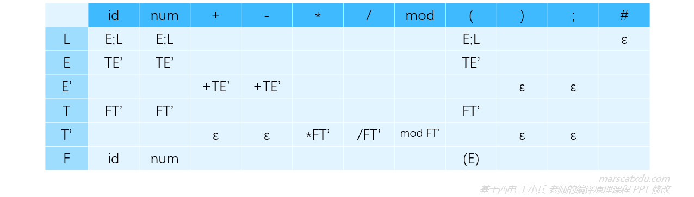
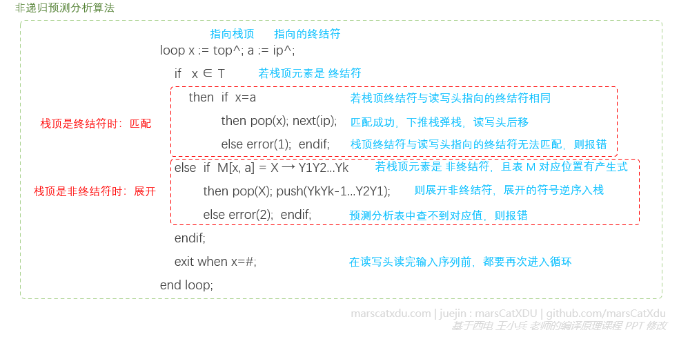
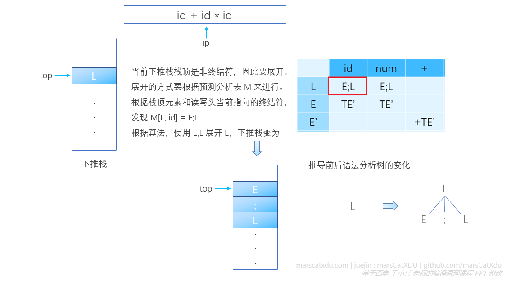
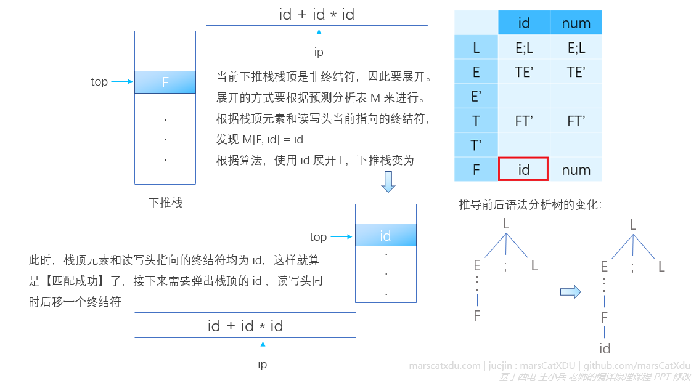
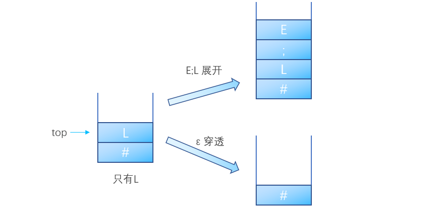
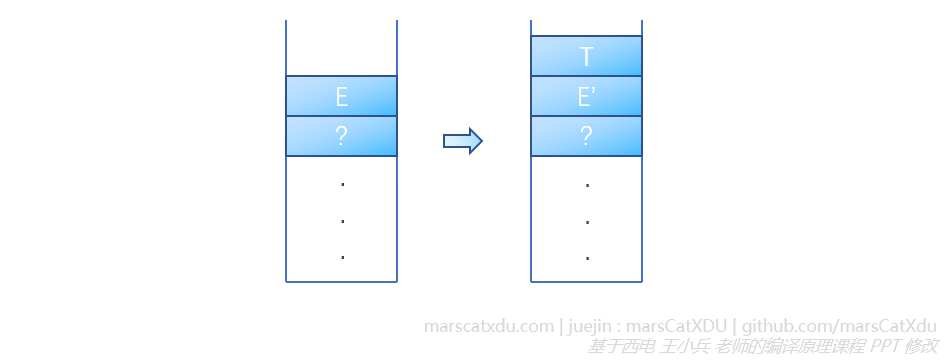

# 编译原理笔记12：自上而下语法分析（2）非递归预测分析器、FIRST & FOLLOW 集合计算

## 使用预测分析器的自上而下分析

使用预测分析器进行的自上而下分析是非递归的。预测分析器模型其实是一种 PDA（下推自动机，Pushdown Definite Automata），其结构如下图所示


上图中的“有限状态转移控制”类似于词法分析中的自动机。下推自动机在单纯的自动机旁增加了一个**下推栈**。将该模型进一步具体化，即得到**预测分析器模型**，如下图所示。


这里的“驱动器”，是一个能够控制读写头读取输入记号流中记号的算法，该算法要综合读到的记号、下推栈情况和预测分析表的内容，来修改符号栈和控制输出。

PDA 可以识别形如 ：ωcω<sup>r</sup> 的串，这样的串是 DFA 无法识别的，这类串也无法使用正规式进行描述。（ps. ω<sup>r</sup> 的意思是终结符序列 ω 的反转形式，比如 <u>abab</u>c<u>baba</u>）。而对于形如 CSG 那种的 ωcω 串，则 PDA 也无法进行识别。

预测分析器通过【格局与格局的变换】进行分析。

#### 格局

格局是一个三元组 `(栈顶元素^top，剩余输入^ip，改变格局的动作)`，改变格局的动作通过查表确定，具体动作包括：展开非终结符、匹配终结符、报告分析成功（^top=^ip=#）、报告出错（遇到上述情况之外的其他情况，要调用错误恢复例程）

我们可以将预测分析器看作一个逐步运行（Step）的机器，每一个 step 都会让预测分析器到达一个新的 **格局** ，直到到达接收格局为止（或者到达出错格局，即发现语法错误。比如推出来的终结符和读写头读到的终结符不一样，或者栈顶和读写头当前指向的终结符所对应的预测分析表元素为空）


## 使用预测分析器进行分析的实例

预测分析器需要借助预测分析表来构造语法分析树。

在进行语法分析时，预测分析器根据符号栈（下推栈）栈顶元素和驱动器读写头指向的记号流中的记号来查询预测分析表，根据预测分析表中对应项的情况来决定下一步的操作。预测分析表形式如下：



预测分析表的行首是非终结符，列首是终结符。

- **当栈顶是非终结符时，展开**：需要根据预测分析表查到候选项，然后使用该候选项来展开栈顶的非终结符——弹出栈顶非终结符，将表中的对应项逆序压入到下推栈中（注意顺序，产生式右部是反着压进去的，因为总要保持从左到右推导）。
- **当栈顶时终结符时，匹配**：若此时栈顶的终结符与驱动器读写头读到的终结符相同，则将该栈顶元素弹出，同时读写头向后移动一个记号。


对于消除了左递归和公共左因子的如下 CFG，我们可以根据其来构造一个预测分析表（具体构造方式留到后面再说）

```
L → E;L|ε
E → TE'
E' → +TE'|-TE'|ε
T → FT'
T' → *FT'|/FT'|mod FT'|ε
F → (E)|id|num
```


我们根据如下算法，来进行非递归预测分析



其实，就是重复进行这样的操作：根据读写头指向的终结符、栈顶元素查预测分析表，不断把表中查到的元素压入栈顶。因为是从开始符号开始推导的，所以栈中会出现【根据预测分析表查到新的非终结符入栈】的情况。如果推导时栈顶是非终结符，则读写头不需要移动，一直指向之前停下的位置。但随着推导的进行，非终结符终究会推出终结符（这个终结符也要和前面非终结符一样，被压入栈），如果这个推导出来的、当前正好在下推栈栈顶的终结符和读写头指向的符号相同，那么就是【匹配上了】

下图说明了【栈顶是非终结符时，进行展开】的过程，执行非递归预测算法插图中的第二个红色虚线框内的代码：



下图同时说明了【栈顶是非终结符时，进行展开】和【栈顶是终结符时，进行匹配】的过程。对于后一个过程，执行非递归预测算法插图中的第一个红色虚线框内的代码：




## FIRST、FOLLOW 集合的构造

预测分析表，其实是一个【为我们指明推导的方向】的工具。那么如何构造这个工具呢？

构造过程分为两步：1. 根据文法给出的产生式构造 FIRST、FOLLOW 集合，2. 根据这两个集合来构造预测分析表。

因此，FIRST、FOLLOW 集合的构造是这里的重中之重。

我们根据下面的块中的产生式来学习这两个集合

<div>
    <div style="border-style: dashed; 
        border-radius:5px; 
        padding:15px; 
        margin:3px 5px 8px 5px; 
        border-width: 1px; 
        border-color: grey">
        L  → E;L | ε<br>
E  → TE'<br>
E' → +TE' | -TE' | ε<br>
T  → FT'<br>
T' → *FT' | /FT' | mod FT' | ε<br>
F  → (E) | id | num<br>
        </div>
</div>

#### FIRST 集合

> 文法符号序列 α 的 FIRST 集合为：
> FIRST(α) = { a | α=\*> a...，a ∈ T }，若 α=\*>ε ，则 ε ∈ FIRST(α)

说白了，FIRST(α) 就是 α 能推出来的所有串（aka. 文法符号序列）中的第一个终结符的集合。如果从某个非终结符开始，一步推不到终结符，那就多推几次。如果直接推出来个 ε，就把 ε 也加入当前 FIRST 集合。

我们以对上面写的产生式求 FIRST 集合为例，来了解怎么求 FIRST 集合。

1. 求 FIRST 集合的过程要顺着我们的一堆产生式从下向上进行，也就是先求 FIRST(F)，最后求 FIRST(L)。对于产生式 `F → (E)|id|num`，容易看出， F 经过一步推导能推出的所有串的第一个终结符有：`(`、`id`、`num`，因此 **FIRST(F) = { (, id, num }**；
2. 对于产生式 `T' → *FT'|/FT'|mod FT'|ε`，T' 经过一步推导能推出的所有串的第一个终结符有：`*`、`/`、`mod`。而又因为 T' 能够直接一步推导出 ε，所以 `ε` 也要加入到 FIRST(T') 中，即 **FIRST(T') = {*, /, mod, ε}**；
3. 对产生式 `T → FT'`，T 没有一步推导就能得到的终结符，所以要继续推导，再推导一步会得到：`T=>FT'=>(E)T'` 或 `T=>FT'=>idT'` 或 `T=>FT'=>numT'`，由此我们可以看到，T 经过两步推导能够推导出的第一个终结符有：`(`、`id`、`num`，（由于 F 推不出 ε，也就是说 F 无法被穿透，因此关于从 T 经过推导推出的第一个终结符就都和 F 的终结符相同了），因此 **FIRST(T) = FIRST(F) = { (, id, num }**；
4. 对于产生式 `E' → +TE'|-TE'|ε` ，与上面的 2 同理，可得 **FIRST(E') = { +, -, ε }**；
5. 对于产生式 `E → TE'`，与上面的 3 同理，可得 **FIRST(E) = FIRST(T) = FIRST(F) = { (, id, num }**
6. 对于产生式 `L → E;L|ε`，要结合上面的 3 和 2 一起理解。首先该产生式可以经过多步推导后得到终结符，这个和 3 同理。然后，该产生式本身也能推出 ε，这与 2 同理。最终可得：**FIRST(T) = { ε, (, id, num }**

即，最终可得：

```
FIRST(F/T/E) = { (  id  num }
FIRST(T’) = { *  /  mod  ε }
FIRST(E’) = { + -  ε }
FIRST(L)  = { ε  (  id  num }
```


#### FOLLOW 集合

> 非终结符 A 的 FOLLOW 集合如下：
>FOLLOW(A) = { a | S=*> ...Aa...，a∈T }，若 A 是某句型的最右符号，则 #∈FOLLOW(A)

说白了，就是从开始符号可以导出的所有含 A 的文法符号序列中 A 之后的终结符。

举个例子的话大概是：FOLLOW(A) 是终结符的集合，从开始符号开始，经过多步推导得到的句型中有【Aa】，则FOLLOW集合中的元素就是这些 a。想要真正理解 FOLLOW 集合，建议尝试在脑内画一个下推栈进行推导（如果脑补不出来，那耐心点一步步画在纸上也是不错的选择），这样会简单许多。

我们以对上面写的产生式求 FOLLOW 集合为例，来了解怎么求 FOLLOW 集合。

1. 求 FOLLOW 集合的过程要顺着产生式从上往下进行，也就是先求 FOLLOW(L)，最后求 FOLLOW(F)。首先求第一个产生式  `L → E;L|ε` 左部的非终结符 L 的 FOLLOW 集合 FOLLOW(L)。
   因为我们想要寻找的是在经过推导后跟在 L 后面的终结符，因此我们要首先扫一眼全部的产生式，看看 L 都在哪些产生式中出现过以获取线索。很不幸，只在第一个产生式中出现过……如果选择 E;L 进行推导将导致 L 的递归——也就是说若只用这个产生式进行推导，无论怎么推都永远推不出一个紧随 L （除了#之外）的终结符，最终还是要面对只有 L 的问题。而若选择 ε 展开 L 则会导致 L 的穿透，暴露出文法的结束符号 `#` ，因此 **FOLLOW(L) = {#}**；
   
2. 再来看第二个产生式 `E → TE' `，这一步我们求该产生式左部的非终结符 E 的 FOLLOW 集合 FOLLOW(E)。
   因为我们想要寻找的是在经过推导后跟在 E 后面的终结符，因此我们先来整体看一下所有的产生式。可以发现非终结符 E 在第一行的产生式 `L → E;L|ε` 和最后一行的产生式 `F → (E)|id|num` 中都有出现。产生式 `L → E;L|ε` 说明，从开始符号 L 开始，经过一步推导得到 `E;L` ，即 L=\*>...E;...因此我们要将 `;` 加入到 FOLLOW(E) 中 。此外，我们还可以发现在最后一个产生式 `F → (E)|id|num` 中，E 后面接上了终结符 `)`，这说明，从开始符号 `L` 开始，经过多步推导，可以出现某一刻将 F 用 (E) 展开的情况——即：L=\*>...(E)...，因此我们要将 `)` 加入到FOLLOW(E) 中。除了这两个产生式之外，再也没有其他右部包含 E 的产生式，也就是说我们找完了 E 后面紧跟终结符的所有情况，故得到：**FOLLOW(E) = { ;, ) }**；
3. 再看第三个产生式 `E' → +TE'|-TE'|ε` ，这一步求 FOLLOW(E')。
   经过观察，我们发现除了这个产生式本身，只有第二行的 `E → TE'` 中出现了 E' 。通过观察这两个产生式，我们可以发现：下推栈中的 E' 只有一个来源，就是被使用  `E → TE'` 展开 E 而来。那也就是说，之前在下推栈中【位于 E 下面的非终结符】将被 E‘ “继承“
   
   因此， **FOLLOW(E') = FOLLOW(E) = { ;, ) }**；
4. 下面来看第四个产生式 `T → FT'` ，这一步求 FOLLOW(T)。
   我们发现 T 还出现在第二个产生式 `E → TE'` 中，因此要将 FIRST(E') 加入到 FOLLOW(T) 中。而又因为 E' 可穿透，因此也要考虑 E' 穿透的情况，故要将 FOLLOW(E) 也加入到 FOLLOW(T) 中。另外，因为 FOLLOW 集合中不能包含 ε，故 ε 不能被加入到 FOLLOW(T) 中。最后，**FOLLOW(T) = {  +, -, ;, ) }**
5. 第五个产生式 `T' → *FT'|/FT'|mod FT'|ε` ，这一步求 FOLLOW(T')。
   与上面的 3 同理，FOLLOW(T) 被 FOLLOW(T') ”继承“，得到 **FOLLOW(T') = FOLLOW(T) = {+, -, ;, ) }** 
6. 第六个产生式 `F → (E)|id|num` ，这一步求 FOLLOW(F)。
   由产生式 `T' → *FT'|/FT'|mod FT'|ε` 可知，FIRST(T') 应被加入 FOLLOW(F)。而 T' 可穿透，故 FOLLOW(T') 也应被加入 FOLLOW(F)。因此，**FOLLOW(F) = { *, /, mod, +, -, ;, ) }**

即，最终可得：

```
FOLLOW(L) = { # }
FOLLOW(E/E’) = { )  ; }
FOLLOW(T/T’) = { + - ; ) }
FOLLOW(F) = { + -  *  /  mod  )  ; }
```

