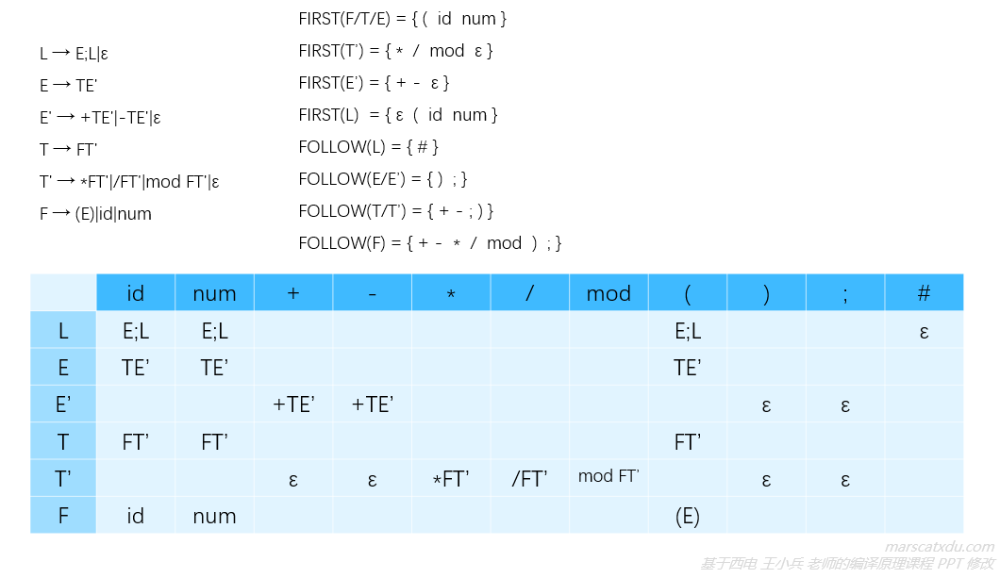
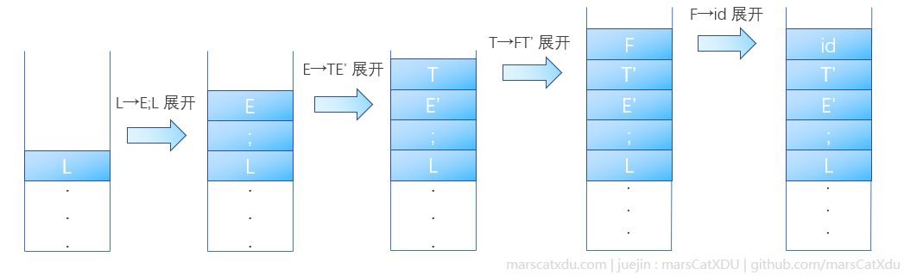
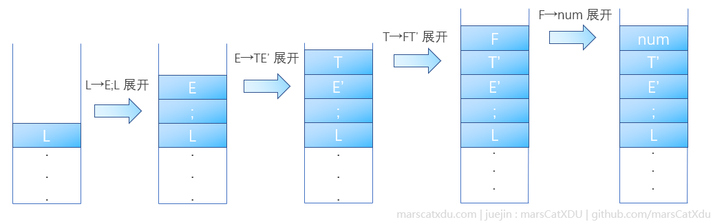
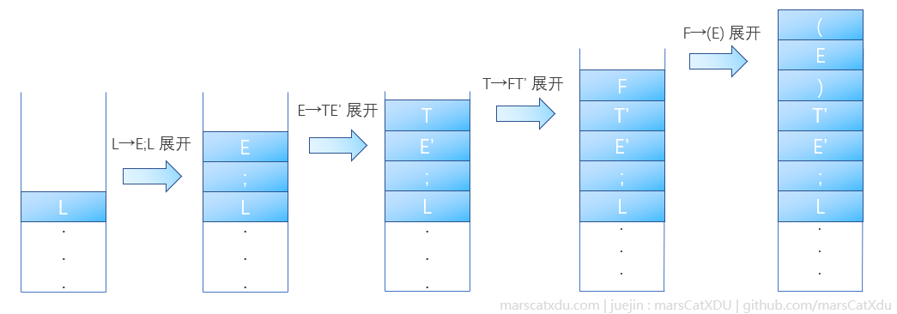

# 编译原理笔记13：自上而下语法分析（3）构造预测分析表、LL(1) 文法

## 构造预测分析表

预测分析表的作用，是为推导的进行指明方向——我们用当前下推栈栈顶和读写头所指向的符号的组合（即当前的状态），去查询预测分析表，以确定推导的下一步该向着何种方向前进。

推导应该前进的方向，由 FIRST、FOLLOW 集合说明——这两个集合能够说明，我们可以通过怎样的方式来一步步向着终结符靠近。

### 不懂也能用的构造步骤

预测分析表构造的步骤如下，建议按照例子实操一遍。实在想不通，背下来步骤应该也可以把表构造出来。

1. 看待填行的行首非终结符 A
2. 找到左部是上面看到的这个非终结符 A 的产生式，根据产生式右部的不同，按以下三种情况处理：
   1. 如果产生式是以非终结符 B 打头的序列 α ，那么找到 FIRST(B)，将 FIRST(B) 集合中每个元素所在列、非终结符 A 所在行确定的位置填写上序列 α
   2. 如果产生式是以终结符 a 打头的序列 β ，那么直接去找终结符 a 所在列，并将 β 填入 A 行 a 列的位置中
   3. 如果产生式是 ε，则找到 FOLLOW(A) ，将 FOLLOW(A) 集合中每个元素所在列、非终结符 A 所在行确定的位置填写上 ε

概括来说，就是：根据产生式左部的非终结符确定本次要构造的分析表行。根据 FIRST、FOLLOW 集合，将产生式右部填入分析表，以此确定每行的内容。比如对于产生式 `L → E;L|ε`，我们需要把产生出来的右部 `E;L` 和 `ε` 填入到分析表 L 行的某些位置中。

实例如下：

### FIRST、FOLLOW 和分析表的原理？

FIRST、FOLLOW 集合都能够说明一些东西，比如， FIRST(L) 集合告诉我们：

- 如果此时栈顶是 `L` ，而读写头读到了 `id`，那么我们应该用 `E;L` 来进行展开，因为这样可以让推导过程向着【把栈顶元素变为`id` 】的方向前进。这是因为从 E 开始经过数步推导后，`E` 能够最终展开为 `id` 而完成匹配
  
- 如果此时栈顶是 `L` ，而读写头读到了 `num` ，那么我们应该用 `E;L` 来进行展开，因为这样可以让推导过程向着【把栈顶元素变为 `num`】的方向前进。这是因为从 E 开始经过数步推导后，`E` 能够最终展开为 `num` 而完成匹配
  
- 如果此时栈顶是 `L` ，而读写头读到了 `(` ，那么我们应该用 `E;L` 来进行展开，因为这样可以让推导过程向着【把栈顶元素变为 `(`】的方向前进。这是因为从 E 开始经过数步推导后，`E` 能够最终展开为 `(` 而完成匹配
  

而当产生式右部是 ε 时，根据该产生式左部的非终结符所对应的 FOLLOW 集合来确定这个 ε 该填到哪里——也就是说，仅当某个非终结符的产生式右部为 ε 时，我们才需要考虑 FOLLOW 集合

- 如果此时栈顶是 `T'`，而读写头读到了 `+` ，那么……嗯，`T'` 可没有展开为 `+` 的产生式啊，但 `T'` 可以被穿透，其 FOLLOW 集合 `FOLLOW(T')` 是包含 `+` 的；
- 同理，如果此时栈顶是 `T'`，而读写头读到了 `-` ，也可以通过选择将 `T'` 以 ε 展开而穿透的方式来向着推出 `-` 的方向前进。

## LL(1) 文法

LL(1)，第一个 L ，代表从左到右扫描输入序列，第二个 L 代表推导的过程是最左推导。1 则代表只有一个读写头（也就是每次都只向前看一个终结符）

该文法的分析表的每个格子中只能有一个产生式的右部。该文法必须是非二义的，文法的产生式不能包含公共左因子和左递归。

LL(1) 文法使用范围有限，实际主要使用 LR(1) 文法。LR(1) 文法是 LL(1) 文法的真超集