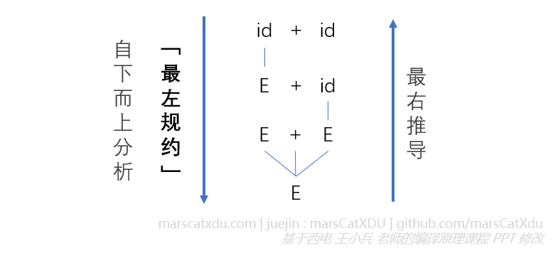
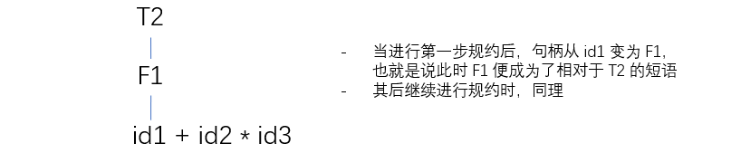
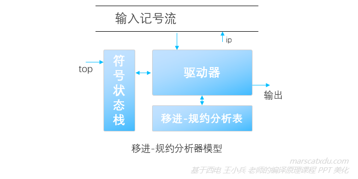
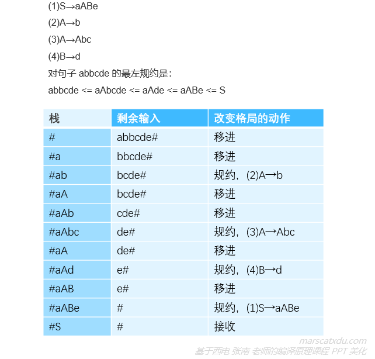
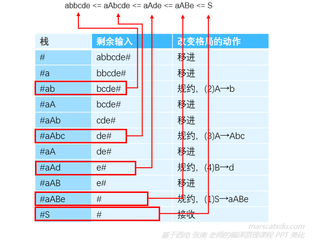

# 编译原理笔记14：自下而上语法分析（1）短语、句柄，规约，移进规约分析器的工作模式

## 基本方法

> 从句子 ω 开始，从左到右扫描 ω，反复用产生式的左部替换产生式的右部、谋求对 ω 的匹配，最终得到文法的开始符号（或，发现错误）（也就是从下往上搞出个树，最后推到根也就是开始符号了）

在分析的过程中，每一步都总是尝试在句型中寻找一个能够被替换为产生式左部的子串。就这样一步步向上去替换，最终变成一个开始符号。

而，由于我们对记号流的扫描是从左到右的，故我们【尝试寻找句型中能够被替换为产生式左部的子串，并不断进行替换】的过程也是从左到右的。这样从记号到开始符号一步进行自下而上分析的逆过程其实就是一个最右推导！

推导的逆过程，就叫做【规约】。最右推导的逆过程，就是最左规约。

## 短语、句柄，规范规约，剪句柄

最右推导叫做【规范推导】，因此作为其逆过程的最左规约，也就是【规范规约】了

### 短语、直接短语和句柄

> 设 αβδ 是文法 G 的一个句型，若存在 S =*> αAδ ， A =+> β，则称 β 是句型 αβδ 相对于 A 的【短语】。若 A→β ，则称 β 是句型 αβδ 相对于产生式 A→β 的【直接短语】。一个句型的最左直接短语被称为【句柄】。
>
> 句型，是一个完整的结构，短语则是句型中针对某非终结符的局部。因此，开始符号 S 是句型而不是短语。
>
> 短语形成的要素：
>
> - S 可推导出 A，即 S=*> αAδ ；
> - 从 A 开始经过至少一次推导推出 β，即 A=+> β。

**我个人认为（俺寻思）**：进行规约的一大关键点，是怎么在一堆本质上是字符串的符号流中，试图搞明白 “这到底哪几个连在一块的字符算一个符号啊？这到底几个符号连起来能和哪个产生式的右部匹配上啊？” 的问题。而这里的【短语】、【直接短语】、【句柄】概念，其实就是**描述产生式右部的组合及边界**的方案——回想自然语言中的 “短语”，自然语言中的短语是指由至少两个单词构成的、有序组合起来共同表达某一个含义的有序单词序列——只有特定的单词以特定的顺序组成序列才能被称为**一个**短语。那么语法分析中的短语也是一样的：语法分析中的短语是指由至少数个终结符或(和)非终结符构成的、有序组合起来的符号序列，这个序列就是某个产生式的右部，也就可以在规约时被规约为一个产生式的左部。

反映在上面定义的例子中，就是：

- β 是句型 αβδ 相对于 A 的【短语】，那么 αβδ 就可以经过至少一步规约后规约为 αAδ 。而 αAδ 则能够在经过零或多步规约后，最终规约为开始符号 S；
-  β 是句型 αβδ 相对于产生式 A→β 的【直接短语】，那么 αβδ 就可以在经过一步规约后成为  αAδ ；

短语，不一定是包含终结符的序列，也可以是单个的非终结符。在整个规约的过程中，句柄会不断变化：毕竟，根据定义，短语只是【从开始符号 S 可以导出（经过零或多步推导，不导也行。。）的非终结符 A 在经过至少一步推导后得出的句型】。那么在下面这个例子中，从开始符号 S 一定是可以经过推导得到非终结符 T2 的，T2 也能在经过一步推导后展开为 F1。那么，F1 就是 T2 的短语（而且是直接短语，而且是最左直接短语，那么这里的 F1 就是 T2 的句柄了）

- 短语：以非终结符为根子树中所有从左到右的叶子
- 直接短语：只有父子关系的树中所有从左到右排列的叶子（树高为2）
- 句柄：最左边父子关系树中所有从左到右排列的叶子（句柄是唯一的）

### 规范规约（最左规约）

> 若 α 是文法 G 的句子且满足下列条件，则称序列 αn, αn-1, ..., α0 是一个最左规约：
>
> 1. αn = α
> 2. α0 = S（ G 的开始符号）
> 3. 对任何 i(0 < i <= n)，αi-1 是将 αi 中的句柄替换为相应产生式左部的非终结符得到的。

#### 例：

文法：(1)S→aABe    (2)A→b    (3)A→Abc   (4)B→d，对句子 abbcde 的最左规约是：

abbcde <= aAbcde <= aAde <= aABe <= S

上面这个过程，从左往右看是最左规约（称为规范规约），从右往左看就是最右推导了

其实，上面的过程是非常简略的，这里有一些关键的细节需要到后面才能逐渐搞明白。比如，第二步到第三步规约的时候，为什么没有把 aAbcde 规约为 aAAcde？（这是因为如果这样规约就无法继续规约下去了）解决这个问题其实就要用到我们前面博客中说过的 FIRST、FOLLOW 集合以及下推栈。

## 移进-规约

规约，是用产生式左部的非终结符替换序列中和产生式右部相同的子串的过程。因为规约时对输入序列进行的扫描是从左到右的，所以在规约的过程中每次找的都是序列中的最左直接短语（即句柄）进行规约。

在这个规约的过程中，语法分析程序要做的，就是对输入的符号流中的字符进行扫描，并根据扫描到的字符的情况来对其进行相应的处理：如果可以进行规约则进行规约，如果不能进行规约则进行其他操作。

因为显然，规约不可能是从左到右逐个字符进行处理即可，在实际规约的过程中一定会出现暂时无法进行规约（或者出错）的情况，比如上面那个例子中，排在输入序列第一位的 a 直到最后一步规约中才与句型中的其他符号一起被规约为 E。这说明在规约的过程中，会有“先搁置某些符号，待时机成熟再进行处理”的需求。

这也就是说，我们的语法分析程序需要能够将【暂时不能规约的】字符先按照顺序记录下来。在后面规约的过程中，这个（些）暂时无法被规约的符号要一边等着后面其他可以规约的符号进行规约，一边被语法分析程序监视着——语法分析程序需要能够看情况决定是否要在某次规约中把前面存下的符号加入规约。对字符的存储依然使用栈来进行——用一个栈来存储【将要包含句柄的前缀】，然后在后面不断读取输入字符时，判断已经放在栈中的前缀能否进行规约。

语法分析器对能否规约的判断（什么时候规约、用什么产生式进行规约）也都要依靠一个表来进行，这个表叫做移进规约分析表。

上面这个就是【移进规约】的方法：用栈存储将要包含句柄的输入序列的前缀，用分析表确定【何时栈顶已经形成句柄】以及确定【进行规约要用到的产生式】。

在句柄形成前，要不断将字符从输入序列中移动到栈中。待到栈顶形成句柄时，再将这些符号串规约为一个非终结符。

移进-规约的方法，就是不断地判断扫描过的这部分输入序列的前缀，是否能够被成功地转换为栈中的符号序列。能不能把扫描过的输入序列变成一个文法的【活前缀】（这个词后面会解释）。

土味解说：俺寻思，这语法分析器分析语法，其实就和我们理解人说话差不多：我们说的每句话都包含至少一个单词，有些单词和单词之间是有关联的（也就是多个单词组成一个短语，共同表达一个含义，此时这几个组成短语的单词已经相当于一个整体，需要整体考虑来进行理解）。我们在听其他人说话的时候，我们的耳朵在每个时刻就相当于是一个在读取符号的读写头，追着说话人口中输出的符号流进行读取，并用脑子暂存这个人刚刚说过的某个词，准备与接下来听到的新的词进行关联、整体进行理解。
我们把别人说一半的话先存进脑子等待下文，就是移进（把人家说一半的话移动进入脑子）。
我们完整听完了人家的一段话，可以把这段话进行整体的理解、提取归纳为一个含义，就是规约。

## 移进规约分析器的工作模式

移进规约分析器的模型和预测分析器非常类似，如下图所示

其中的 **符号状态栈** 能构成对存储符号和状态——不止像之前学过的符号栈一样只存储符号，还要存储和这些符号相关的一个状态值。符号和状态在栈中成对存储。

**移进-规约分析表** 会告诉我们是否能够进行规约，如果规约的话按照哪个产生式进行规约。该表的种类不唯一，根据该分析表的不同，可以将移进规约分析器分为【算符优先分析器】、【LR 分析器】等种类。这些分析器都属于移进规约分析器的不同实现。

移进规约分析器的工作方法，是一步一步进行从格局到格局的转换。这里的格局也是个三元组 `(#栈，当前剩余输入#，改变格局的动作)`。每到一个新的格局，分析器都要通过查表来确定下一步的动作——该移进还是该规约，如果是规约那该按照哪个产生式进行规约。

语法分析，就是从某个初始格局开始经过一系列的格局变化，最终达到接收格局（成功）或出错格局（发现语法错误）

- 栈：存放文法符号和状态，并且符号和状态成对出现；
- 剩余输入：初始格局时为全部序列；接收格局时剩余输入为空；其他格局时是原输入序列的一个后缀。
- 动作：驱动器根据当前栈和剩余输入来查找分析表确定相应动作，并根据这些动作来改变栈和剩余输入的内容、进入下一格局。能改变格局的动作列举如下：
  - 移进（ shift ）：将输入序列中的终结符进栈。该动作在当栈顶没有形成句柄时（也就是暂无法规约时）进行；
  - 规约（reduce）：当栈顶形成句柄时，根据产生式来将栈顶句柄替换为对应非终结符；
  - 接受（accept）：语法分析成功；
  - 报错（error）：发现语法错误，调用错误恢复程序。

#### 移进规约分析例：

用移进-规约方法分析 abbcde

如果把【发生变化了的】句型单独拿出来，从下到上看就是一个最右推导的过程（从下到上就是最左规约了）

注意

1. 在最左规约中，句柄总是在栈顶形成的：语法分析器在进行一次规约后，都必须接着移进 0 或多个符号才能在栈顶找到下一个句柄；
2. 栈中总是含有一个右句型的前缀，且该前缀不包含句柄之后的符号。这个前缀就叫做【活前缀】（在推导的过程中，若每次直接推导均替换句型中最左边的非终结符，则称为最左推导。由最左推导产生的句型被称为左句型。右句型与之对称）。

移进规约分析需要解决的两个关键问题：

1. 如何判断栈顶是否形成了句柄；
2. 当形成句柄的时候，如何选择产生式。

说白了，就是要解决：什么时候规约、以及用什么产生式规约的问题

构造分析表，就是构造【识别活前缀的 DFA 】