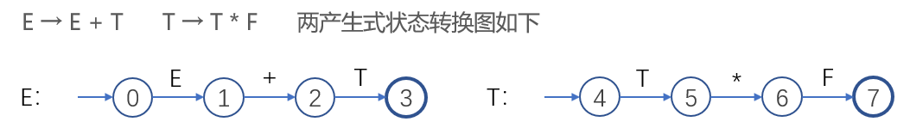
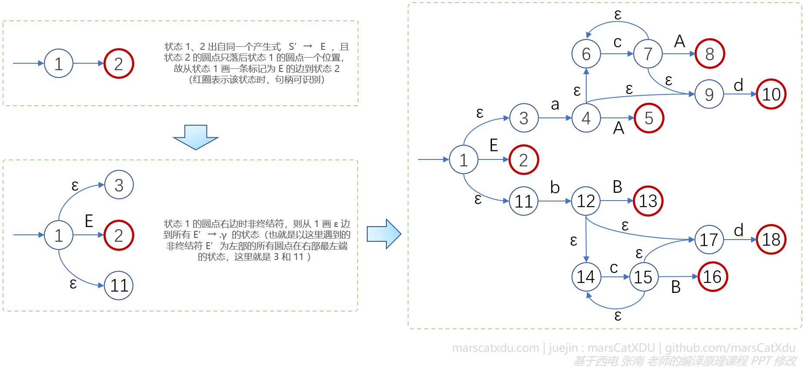

# 编译原理笔记15：自下而上语法分析（2）LR 分析基础、LR 分析表、LR(0) 分析表

## LR分析

### LR 分析的特点：

1. 采用最一般的无回溯移进-规约方法；
2. 适用于几乎所有程序设计语言；
3. 能及时发现错误；
4. 分析表复杂，难以手工构造。

LR 分析表和驱动器是 LR 分析的核心。

以下讨论会基于下面的文法进行：

```
E → E-T | T		(1)(2)
T → T*F | F		(3)(4)
F → -F | id		(5)(6)
```

上面的文法也能够说明 LR 的适用范围更广：

- 产生式可以左递归（预测分析不支持）
- 同一个符号（ - ）可以既是一元的也是二元的（算符优先分析不支持）


### LR 分析表

分析表分为两个部分，分别是【动作表（Action）】和【转移表（goto）】。

- 两个表的行首是**分析器状态编号**，其对应着识别活前缀的 DFA 的状态；
- 动作表的列首包含终结符和结束符；
- 转移表的列首是文法中的非终结符，转移表中的数字是状态号。


- 分析表中：
  - s ： Shift
  - r ： Reduce
  - acc ： Accept
  - 空白 ： 报错
- 转移表中的数字对应行首的状态编号

#### 格局与动作

- 开始格局：（#0， ω#， 移进？）
  - 0： 对应分析表左上角的 0 ，其是识别活前缀的 DFA 的初态，任意语法分析都应该从这里开始；
  - ω：全部的输入序列；
  - 改变格局的动作：一般来说刚开始都是要移进的，除非是一开始就查表查到空白的位置然后出错
- 结束格局：（#0E1， #， 接收）
  - #0E1：# 和 0 是配对的，E 和 1 是配对的。E 后面的 1 是通过查询分析表得到的（0 状态遇到 E ，通过查转移表可知对应的是状态编号 1）；
  - 剩余输入为空，所以只有一个 # ；
  - 接收（acc）：当前栈顶状态编号为 1 ，剩余输入序列中读到 # ，故根据查表可知这个 action[s, 1] 对应着动作表中的 acc ，也就是要执行 acc 这个改变格局的动作了。
  - 把整个文法的符号序列都规约为文法的开始符号 E ，就可以执行接收动作了。
- 出错格局：（#δ， ω'# ， 报错）
  - 根据栈顶的状态号和读写头指向的下一终结符（也就是剩余输入的第一个符号）读到了空白，则会到达出错格局。

##### 改变格局的动作的含义：

1. action[s, a] = si：根据当前栈顶状态 s 和当前读到的终结符 a 去查表的 s 行 a 列，确定改变格局的动作。s 意味着要进行移进（Shift），并在移进后转向到 i 状态（将 i 入栈，压在刚刚移进的符号的上面，与刚刚移进的符号配成一对）；
2. action[s, a] = rj：用第 j 个产生式的左部替换掉栈中的句柄（Reduce）；
3. action[s, a] = acc：接收
4. action[s, a] = 空白：报错

##### 转移表含义：

- goto[s, A] = s' ：指示了非终结符的状态转移。s 表示的是次栈顶的状态，A 表示非终结符。

  当我们刚刚执行一个 action[s, a] = rj 时，栈顶的终结符会被弹出并替换为一个非终结符，此时该终结符位于栈顶，与该非终结符配对的状态需要根据栈顶终结符和次栈顶状态来通过查找 goto 表确定，找到后再将该状态值压入栈顶。

完整的规约动作由 action[s, a] = rj 和 goto[s, A] = s' 两个步骤组成

LR 分析器的工作过程其实可以看作是栈的内容和剩余输入序列所组成的二元组的变化过程（改变格局的动作，也是基于这两个东西去查找分析表确定的），分析开始时的二元组为（#0, a<sub>0</sub>a<sub>1</sub>...a<sub>n</sub>#），中间每一步的结果就可以表示为（#0X<sub>1</sub>s<sub>1</sub>X<sub>2</sub>s<sub>2</sub>...X<sub>m</sub>s<sub>m</sub>, a<sub>i</sub>a<sub>i+1</sub>...a<sub>n</sub>#），栈中的全是文法符号和状态的组合构成的序列。该序列就是一个活前缀，该前缀由 a<sub>0</sub>~a<sub>i-1</sub> 规约而成。

- 移进：当要对 ai 进行移进时，就要先将 ai 入栈，然后根据 sm 和 ai 去查分析表确定下一状态 s，确定后将 s 入栈，读写头指向下一个符号；
- 规约：每次规约后，都要查找 goto 表，生成与栈顶配对的状态编号
  - 若 action[s<sub>m</sub>, a<sub>i</sub>] = 规约A→β，则说明栈顶一段的符号已经形成了 β 文法符号序列，可以进行规约了。
  - 规约需要先将整个 β 出栈（因符号和状态编号配对，故总计需要弹出 2|β| 次。全部弹出完成后暴露出状态 s<sub>m-|β|</sub>），A 入栈。
  - 此时通过次栈顶 s<sub>m-|β|</sub> 和栈顶 A 值查找 goto 表，将结果 goto[ s<sub>m-|β|</sub>, A] = s 入栈。这个 s 就是和 A 配对的状态。

LR 分析算法：


以对 id--id*id 为例，进行举例分析如下：


这时肯定就会有同学说：

“啊~~整挺好，这个 r 后面的值是规约用到的产生式编号，但我要怎么知道规约的时候该用哪个产生式对句柄进行规约呢？”

问得好，这是个很关键的问题，但这是为什么呢？这个到下一篇文章中会介绍。


### LR(k) 文法

> 若文法 G 的分析表中不含多重定义的条目，则该文法为 LR(k) 文法，对应分析器即 LR(k) 分析器，对应语言即 LR(k) 语言。
>
> 其中，L：从左到右扫描，R：逆序是最右推导，k：为了确定下一动作会向前扫描的终结符个数——当确定栈顶是某个产生式的右部时，要再向后扫描输入序列 k 个符号，才能决定是否用该产生式及逆行规约。一般 k<=1 ，k=1 则简称为 LR

这个规约过程中向后扫描终结符，是为了解决【规约-规约冲突】的问题——当规约栈顶可用的产生式的选择超过一个时，可以通过扫描输入序列中后面的一个终结符来辅助决定使用哪个产生式进行规约

（解决这个问题，就要用到这几个右部对应的左部非终结符的 FOLLOW 集合进行判断）


LR分析器是一类分析器。根据分析表构造的不同，可以分为 LR(0)、SLR(1)、LALR(1)、LR(1) 分析器。这几个分析器的功能和构造难度都依次递增。一般不构造 k>1 的分析器（因为太复杂惹）


## LR(0) 项目和 LR(0) 项目集规范族

### LR(0) 分析表构造步骤：

1. 构造可识别文法 G 中所有活前缀的 DFA；
2. 根据 DFA 构造 LR(0) 分析表

该 DFA 的构造也有两种方式，一种是先构造 NFA 再基于此改为 DFA，另一种则是直接构造 DFA 。

本文剩余部分将先讲解如何构造 NFA

#### 活前缀

> 文法 G 中，若在符号序列 α 右边增添零或多个终结符后，能够形成一个右句型且 α 不含该句型句柄之后的任何符号，则 α 为 G 的活前缀。

- 在推导的过程中，若每次直接推导均替换句型中最右边的非终结符，则称为最右推导。由最右推导产生的句型被称为右句型；
- 句柄，是一个句型的最左直接短语；
- LR 分析的任何时刻，栈中的序列都是一个活前缀。如果输入的串语法结构正确，则把输入串中的剩余部分匹配到这个活前缀的后面就能够形成一个右句型；
- 活前缀其实就是一个符号串，一个文法会有很多的活前缀；
- 只要保证已经扫描过的输入序列都可以规约成一个活前缀，则到目前为止的分析就是正确的。

我觉得，这个活前缀，其实就是说【仍然灵活的前缀】。活前缀首先是一个前缀，然后它又是具有灵活性的（能够被塑造、向着不同的方向变化的）

举例说明活前缀：


#### 构造 LR(0) 分析器的关键：为 G 构造一个识别它的所有活前缀的 DFA

步骤：先构造识别活前缀的 NFA，再通过确定化、最小化转为 DFA。

这个 NFA 就是用来识别所有语法 G 的活前缀的，其**从初态到终态路径上的标记就是活前缀**。

##### 状态转换图：

其实就是从产生式直接翻译过来的



产生式 E → E + T 说明了 E 其实无非就是【 E 推导出来的符号序列（被规约规约就变成了 E ）】连接上一个加号，再连接上一个【 T 推导出来的符号序列】。

图中的 0 状态表示状态转换图的初态，后面接着的几个状态，要说明的是：在 0 状态开始，期望看到 E+T 推导出来的输入序列。当自动机跳到 0 状态后面连接的 1 状态，表示已经看到了 E 推导出来的输入序列，我们在 1 状态这里期望从 1 开始看到 +T 推导出来的输入序列（也就是读写头将要读的那些符号，应该可以经过规约后变成 +T ）。

也就是说，识别活前缀就是要在 NFA 的状态中记录下【我看到了产生式的哪个部分、没有看到哪个部分】，即，识别活前缀的 NFA 状态中应该包含并体现产生式的信息（直接放在状态转移上即可）、已经看到和还没有看到的信息（接下来会提到，这个 ”进度“ 是通过在产生式右部序列中插入一个圆点来表现的，通过圆点的位置标记我们已经看到了的序列的进度）

#### LR(0) 项目

NFA 的每个状态都应该能够记录 **从初态到当前状态，已经看到了哪个产生式右部的多少内容。**并基于此来判断下一步该做什么，即：若分析器处于当前状态，则下一步要选择的动作是移进还是规约，如果是规约，那么规约时要用到哪个产生式。

产生式右部加入的点 【 . 】 在右部的位置表示一个 NFA 的状态（这样一个加圆点的产生式就叫做一个【LR(0)项目】）。我们接下来都会用一个 LR(0) 项目表示一个 NFA 状态

一个 LR(0) 项目（简称为**项目**） 是一个产生式，其右部的某个位置有一个点 “ . ” 。特殊的，对于 A → ε 仅有一个项目 A → .

这样的一个项目就代表 NFA 的一个状态，点前面的表示已经看到的产生式部分，后面的表示没有看到的产生式部分。

比如产生式 A → XYZ 共有四个项目： A → .XYZ 、A → X.YZ 、  A → XY.Z 、  A → XYZ.

##### 项目的意义

项目说明分析过程中每个时刻已经看到了产生式的多大一部分，比如：

- A → .XYZ 说明希望从后面的输入串中可以看到【能够从 XYZ 推出的符号串】，如果想要看到它则在此处需要移进
- A → X.YZ 说明已经从输入串中看到了【可以从 X 推出的符号串】，希望进一步能看到【可以从 YZ 推出的符号串】，如果想要看到则此处需要继续移进
- A → XYZ. 说明当前栈顶已经形成句柄了，此时可以进行规约。

比如下面这个例子：


我们接下来的学习路线大概是这样的：

文法 G => 文法 G 的 LR(0) 项目 => 构造识别 G 的所有活前缀的 NFA => 构造识别 G 的所有活前缀的 DFA => 为文法 G 构造 LR(0) 分析表

和词法分析中构造 NFA 的路数比较接近。


### 由文法的 LR(0) 项目构造识别活前缀的 NFA

1. 每个 LR(0) 项目都是 NFA 的一个状态

2. Σ：文法符号和 ε

3. 初态：左边为文法开始符号且圆点在右部最左端的项目

4. 终态：NFA 的所有状态（是的，每个状态都是终态，这个和词法分析 NFA 不同）

5. 状态转移关系 move：若状态 i、j 出自同一个产生式，且状态 j 的圆点只落后状态 i 的圆点一个位置（比如状态 i 为 A → X.YZ，状态 j 为 A → XY.Z），则从 i 画一条标记为 Y 的边到状态 j；

   若状态 i 圆点后面是**非终结符**，比如 i：X → α.Aβ，则从 i 画 ε 边到所有 A → .γ 的状态

下面给出一个例子，文法 G：

```
S' → E
E → aA | bB
A → cA | d
B → cB | d
```

（该文法其实是【拓广文法】，原文法的开始符号就是 E ，我们在这里引入一个新的开始符号 S' ，关于【拓广文法】后面会再提到，这里只需要知道：文法经过拓广后才能够构造 NFA 即可）

其项目：

```
1  S' → .E
2  S' → E.
3  E → .aA
4  E → a.A
5  E → aA.
6  A → .cA
7  A → c.A
8  A → cA.
9  A → .d
10 A → d.
11 E → .bB
12 E → b.B
13 E → bB.
14 B → .cB
15 B → c.B
16 B → cB.
17 B → .d
18 B → d.
```

方法：



所有的状态都是 NFA 的终态，红圈圈上的是【句柄识别态】，处在该状态时，圆点在整个产生式的最右端，语法分析处于这些状态的时候意味着已经【看到了产生式的完整右部】，自然也就可以进行规约了。

所有的状态都是 NFA 的终态，只要能够在 NFA 中任意找到一条路径，那这条路径的序列就是一个活前缀