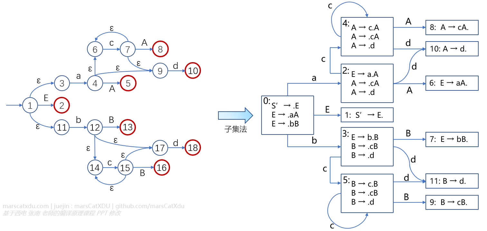
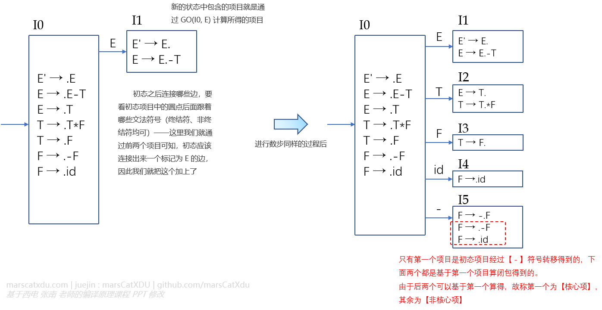
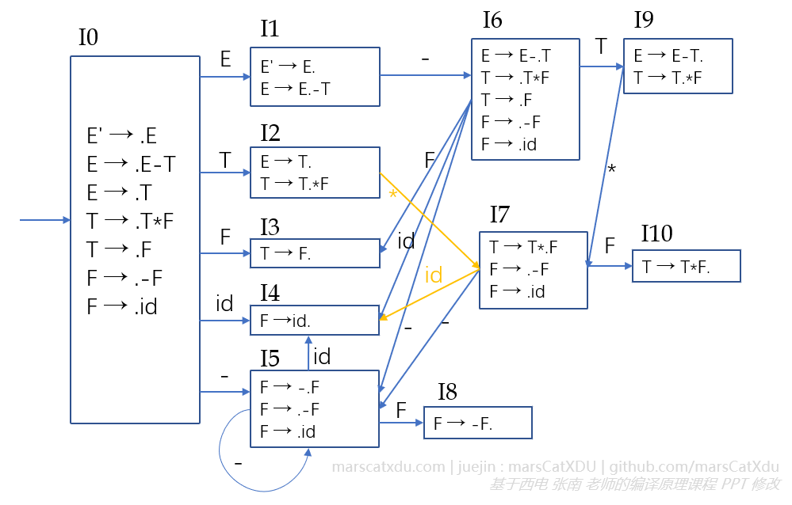
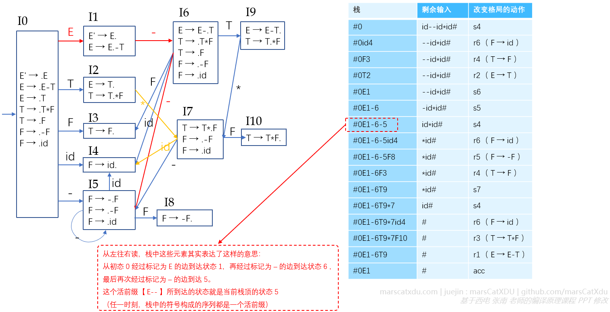
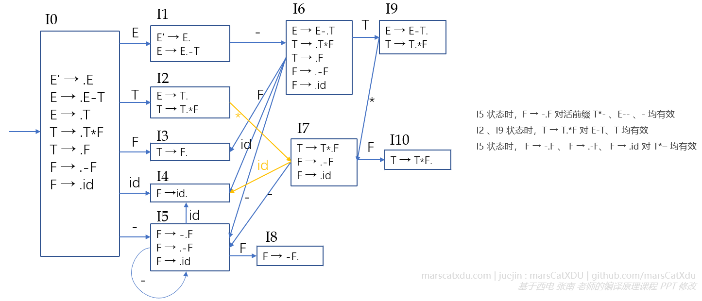

# 编译原理笔记16：自下而上语法分析（3）构造 DFA、DFA 对下一步分析的指导（有效项目）

看了前面的内容，我们已经了解到：分析表和驱动器算法，是 LR 分析器的核心。

在分析的过程中，语法分析器总是根据栈顶的状态、当前剩余输入的第一个终结符查询分析表，以确定改变格局的动作并执行，实现对栈和剩余输入的内容的修改，从一个格局转移到另一个格局，如此往复直至分析完毕（或报错）。

下面我们就来研究一下如何从文法构造 DFA —— 这是构造 LR(0) 、SLR(1) 分析表的第一步。 

## 由 NFA 用子集法构造 DFA

前一篇博客中讲解了该如何构造 NFA，有了 NFA 就可以使用子集法构造 DFA 了。

构造方法与词法分析的 NFA 转 DFA 类似，此处不再重复，接下来说一些该 DFA 的特点。



DFA 中的每个状态都是原 NFA 的状态集（因为 DFA 是 NFA 使用子集法构造的）。而又因 NFA 的每个状态都对应一个项目，所以 DFA 中的每个状态又是一个项目集。

DFA 的初态由原 NFA 初态求 ε-闭包得到，DFA 中的所有状态都是其终态。

（类比子集法构造词法分析 DFA——DFA 的终态是包含原 NFA 终态的那些状态，而原来的那个 NFA 本身就已经所有状态均为终态了，也就是说从初态出发到达任何一个状态的路径所标记的连接都是该 DFA 可识别的活前缀。同理，原来的句柄识别态到这里依然是适用的，就是图中的 1、8、10、6、7、11、9 ）


该识别活前缀的 NFA 和原来的词法分析 NFA 有一个重大差别：词法分析 NFA 状态号就只是一个编号，而此处的状态编号却是和项目相对应的——每个编号就对应着一个项目，而且状态的转移关系也是基于这些项目建立起来的。

那么。。其实也可以直接从项目构造 DFA


## 由 LR(0) 项目直接构造识别活前缀的 DFA

> LR(0) 项目集规范族：构成识别一个文法活前缀的 DFA 的项目集（状态）的全体，称为这个文法的 LR(0) 项目集规范族。这个规范族提供了建立一类 LR(0) 和 SLR 分析器的基础。

实际上，这个【规范族】就是我们要构造的识别活前缀的 DFA 的状态的全体——上面那个 DFA 中所有的矩形状态加起来就是了。主要是因为 DFA 的每个状态都是一个 LR(0) 项目集，所以就想起来这么个骚名字叫做【LR(0) 项目集规范族】

（如果题目让计算一个LR(0) 项目集规范族，那其实就是要计算识别活前缀的 DFA。有了 DFA 就可以构造 LR(0) 分析表和 SLR(1) 分析表了）

我们先给项目做做分类、起起名字，后面要用到：

- 圆点在最右端的项目（如 A → α. ，A 不是拓广文法的开始符号）称为”规约项目“，在出现规约项目的状态就可以进行规约动作；
- 文法开始符号 S' 的规约项目称为”接受项目“（比如 S' → α. ）；
- 形如 A → α.aβ 的项目称为”移进项目“，a 为终结符。在该状态下，如果下一个输入是终结符 a 则可以进行移进动作；
- 形如 A → α.Bβ 的项目称为”待约项目“，B 为非终结符。”待约项目“的含义是【等待把 B 规约出来】：若想按照该产生式进行规约，就得先想办法把 B 搞出来，看到 B 之后才能进行后面的规约动作；（B 是非终结符，可是输入序列中么的非终结符啊。。因此，想要用这个产生式进行规约那需要凑齐该产生式的右部——先把输入序列中由 B 推导出来的符号序列规约成 B 就可以了）


### 构造 DFA

#### 求拓广文法 G'

> 拓广文法： G' = G ∪ { S' → S }

其实就是先引入一个新的非终结符 S' 作为拓广文法的新的开始符号，并引入新的产生式 S' → S

#### CLOSURE & GO

> 1. CLOSURE( I )：从项目集 I 不经过任何文法符号到达的项目全体（和词法分析中的 ε-闭包(I) 的含义相同）
> 2. GO( I, X )：所有从 I 经文法符号 X 能到达的项目全体（只需要到达就好了，不止一步也可以。因此要先计算直接到达的，再在能够直接到达的基础上求闭包。因此显然，GO 和词法分析 NFA 的 smove 的功能不对等：GO 含有闭包计算）。X 只是一个文法符号，终结符、非终结符均可。

##### 例：

对于下面的文法 G，若 I={ S → .E }

```
S' → E
E → aA | bB
A → cA | d
B → cB | d
```

- 求 CLOSURE(I) 

  CLOSURE(I) = { S' → .E, E → .aA, E → .bB }

  首先，S' → .E 是项目集自身元素，自然不需要经过任何文法符号即可到达。后两个项目则是因为他们均可由初态通过 ε 边即可到达，同样满足【从项目集 I 不经过任何文法符号到达的项目】这一要求。（此处可以脑补一下 NFA 图）

- 求 GO(I, a)

  GO(I, a) = { E→a.A, A→.cA, A→.d }

  首先， E→a.A 是直接而从 I 中的项目出发经过 a 能够到达的项目。后面两个项目则可由这个  E→a.A 通过 ε 边可到达。这也符合“所有从 I 经文法符号 a 【能】到达的项目全体”这一定义。

#### 构造 DFA

构造下面的文法 G' 的 DFA

```
E' → E
E → E-T | T
T → T*F | F
F → -F | id
```

首先求 CLOSURE( {E' → .E} )，并将其作为整个 DFA 的初态，即：

I0 = CLOSURE( {E' → .E} ) = { E' → .E, E → .E-T, E → .T, T → .T*F, T → .F, F → .-F, F → .id }

将 I0 作为初态，其实也就是像下图左边这样，画一个矩形大方框再把 I0 里面的这些个项目依次写进去。。这整个一个方框就是我们的 DFA 的初态了。接下来就可以从该初态出发，逐步构造 DFA 。这个逐步构造的过程，无非也就是【挨个算一下从初态的各个项目起，经过哪些文法符号可以得到哪些新项目】，新项目自然也就可以形成新的状态，通过转移用的文法符号与原来的状态相连。



使用同样的规则重复操作（摊大饼），最后能得到如下图所示的 DFA



该 DFA 就能够用来识别活前缀了。与词法分析 DFA 不同的是，该 DFA 的任何一个状态都是终态。这也就意味着，从初态开始到任一个状态所形成的路径上面的标记连接起来，都是一个 DFA 能够识别的活前缀。

比如，对于状态3（即 I3），其能够识别的活前缀有 F 和 E-F；状态6能够识别的活前缀只有 E-

现在，我们再回头看一下移进规约的过程就会发现一些有意思的东西



确实，每个时刻，栈中的内容都和分析表、自动机有着关联。我们可以尝试去读栈中任一时刻的元素（从栈底到栈顶），这些状态号、文法符号相间的序列均能在上图左边的 DFA 中和一条路径相匹配。


## DFA 指导下一步分析

> 1. DFA 每个状态识别的活前缀不同；
> 2. 对语法结构正确的输入序列进行分析的任一时刻，若此时分析器正处于 DFA 的某状态 i ，则状态 i 识别的活前缀出现在栈中，且状态 i 正位于栈顶。语法分析器正是根据此刻状态 i 中包含的 LR(0) 项目来指导下一步分析的；
> 3. 状态 i 中出现的 LR(0) 项目对状态 i 能够识别的活前缀有效。

好的，DFA 看起来是个好东西，那么我们现在假设栈顶是 5 状态，此时 DFA 怎么指导下一步的分析呢？

### 有效项目

> 若存在最右推导：S' =*> αAω => αβ<sub>1</sub>β<sub>2</sub>ω ，则称项目 A → β<sub>1</sub>.β<sub>2</sub> 对活前缀 αβ<sub>1</sub> 有效。
>
> 项目 A → β<sub>1</sub>.β<sub>2</sub> 对活前缀 αβ<sub>1</sub> 有效，作用是说明：在当前活前缀为 αβ<sub>1</sub> 的情况下，当前状态中的 A → β<sub>1</sub>.β<sub>2</sub> 这个项目可以指导下一步的分析动作为： αAω => αβ<sub>1</sub>β<sub>2</sub>ω 。

我觉得吧：已经读到并且已经入栈的东西，全都是活前缀。活前缀呢，就是仍然可以活动的前缀——根据其后添加的符号不同，这个活前缀可能会变成某个句柄——也就是说，活前缀能够在后面加入某些新的符号之后成为某个产生式的右部，也就可以被用这个产生式规约掉。

对于符号串 αβ<sub>1</sub>β<sub>2</sub>ω ，看起来应该是可以使用 A → β<sub>1</sub>β<sub>2</sub> 对其进行规约。读写头在读输入序列的时候是一个一个符号去读，读到了要移进的也是一个接着一个压栈。当栈中是 αβ<sub>1</sub> （即当前活前缀是 αβ<sub>1</sub> ）时，如果我们已经知道有这么个项目： A → β<sub>1</sub>.β<sub>2</sub> ，那就说明如果下一个读到了 β<sub>2</sub> ，栈顶就能够形成该产生式的句柄，我们也就可以利用这个项目的下一步项目 A → β<sub>1</sub>β<sub>2</sub>. 进行规约了。

这其实就体现了 DFA 对分析的指导作用。




可知：同一项目集中的所有项目，对此项目集的所有活前缀均有效。即，项目集中的每个项目均有同等权利指导下一步动作。

有效项目的意义：

1. 项目到目前为止的分析均是正确的；
2. 可以指导下一步的分析：
   1. A → α.aβ（可移进项）：若当前剩余输入为终结符 a ，则移进 a；
   2. B → β. （可规约项）：按产生式 B → β 进行规约。

