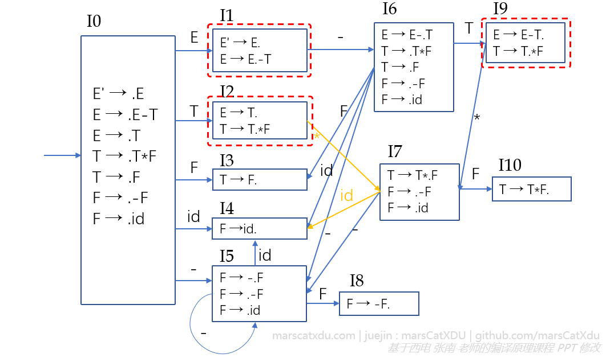
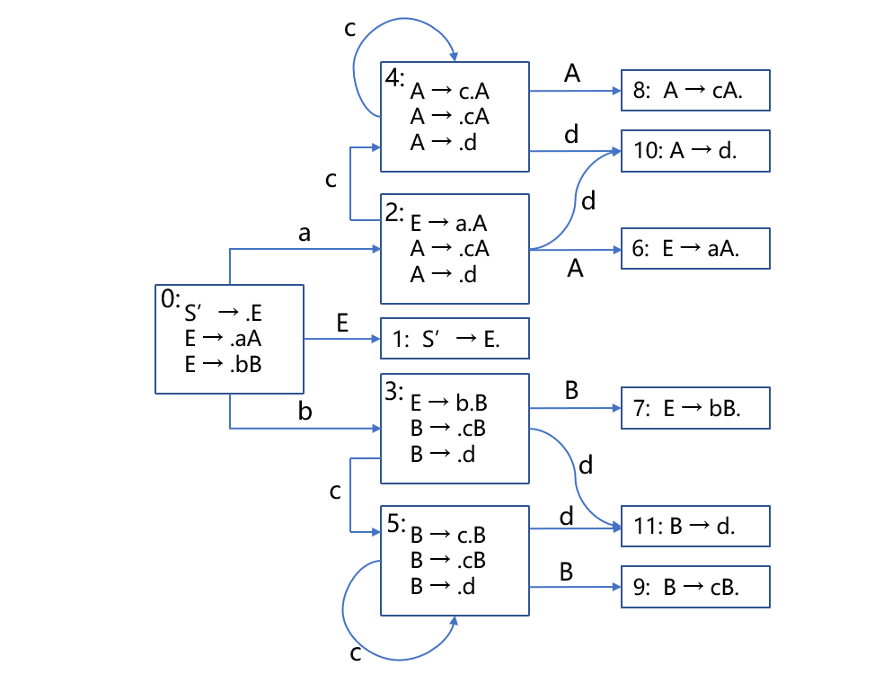
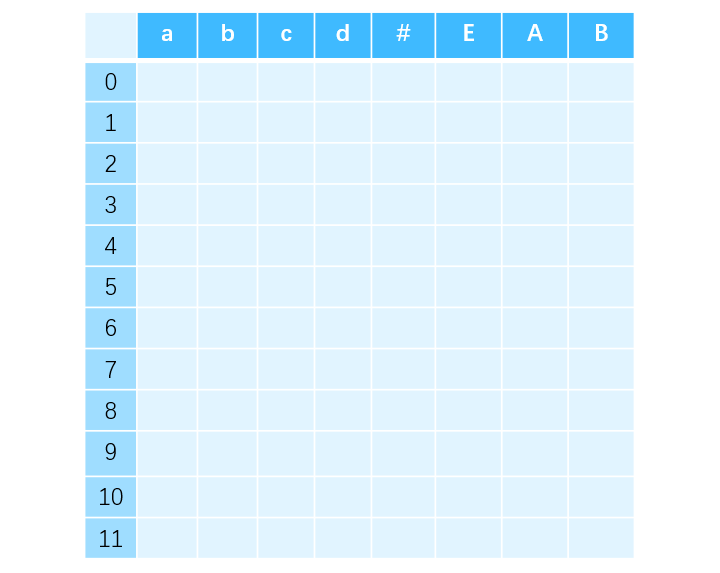
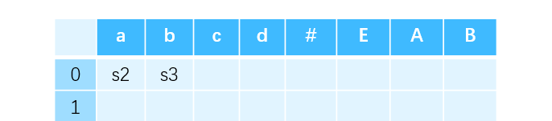
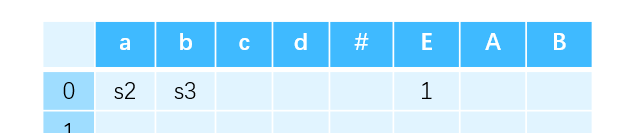
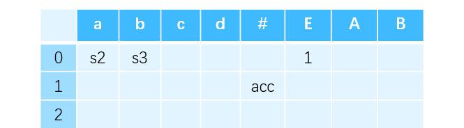
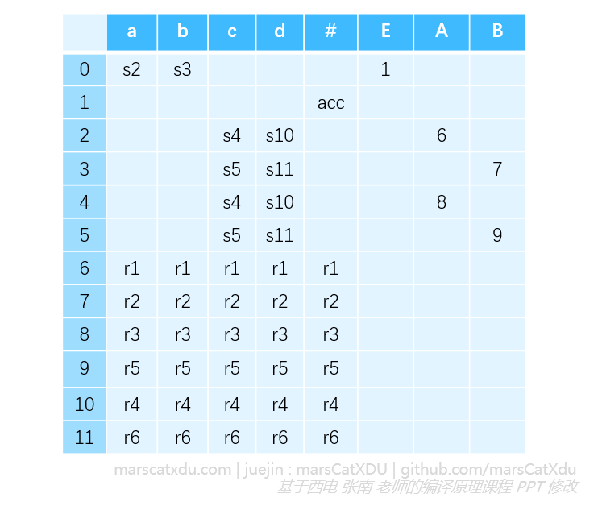
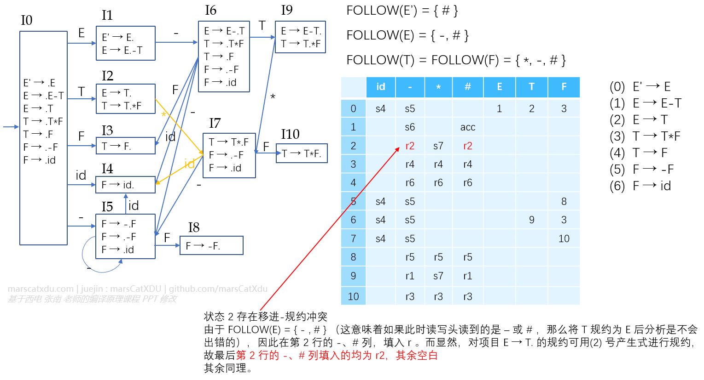
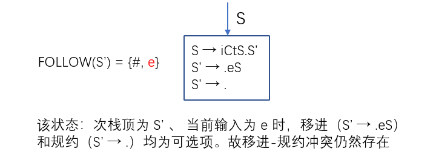
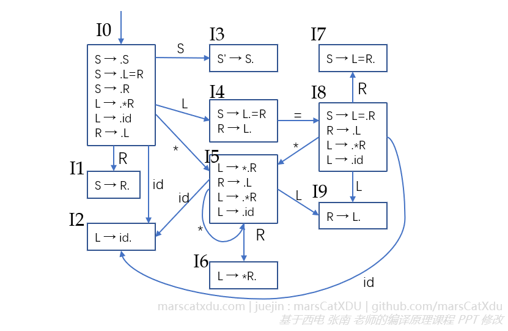

# 编译原理笔记17：自下而上语法分析（4）LR(0)、SLR(1) 分析表的构造

## LR(0) 文法

> 若一个文法 G 的拓广文法 G' 的识别活前缀的自动机中的每个状态（项目集）均不存在下述情况：
>
> 1. 既有移进项目又有规约项目（移进-规约冲突）；
> 2. 含有多个规约项目（规约-规约冲突），
>
> 则称 G 为一个 LR(0) 文法

（移进项目就是指圆点右边是终结符的项目，规约项目指的就是圆点在右部最右端的项目）

如下图所示就不是一个 LR(0) 文法，红框状态中的项目中均存在移进-规约冲突，且均是上面的项目为规约项、下面的项目为移进项。



LR(0) 文法可以直接通过识别活前缀的 DFA 来构造 LR 分析表

### LR(0) 分析表的构造

假定 C = {I<sub>0</sub>, I<sub>1</sub>, ... , I<sub>n</sub>} （aka. LR(0) 项目规范族、DFA 状态集）

首先为文法产生式进行编号，拓广文法的产生式要标记为 0（这里就是后面分析表中 rj 的产生式编号 j 的由来）

然后令每个项目集 I<sub>k</sub> 的下标 k 作为分析器的状态（行首），包含 S' → .S 的集合下标为分析器的初态（也就是 DFA 的初态，一般都是 0 ）。

下面用一个例子来说明 ACTION、GOTO 子表的构造：

#### 例

1. 对产生式进行编号并画出 DFA

   ```
   (0)  S' → E
   (1)  E → aA
   (2)  E → bB
   (3)  A → cA
   (4)  A → d
   (5)  B → cB
   (6)  B → d
   ```

   

2. 根据 DFA 的项目集确定分析器状态，写出分析表的行下标（行首）。并根据分析表的要求写出 ACTION、GOTO 子表的列下标（列首）。ACTION 表列下标是所有的终结符，GOTO 表的列下标是除了拓广文法新加入的非终结符之外的所有其他非终结符
   

3. 填写表格内容——实际上就是把 DFA 中的各个转移的边都挪进来。具体就是要逐个去看

   1. 对于移进项目：从初始的 0 状态出发，有一条标记为 a 的边连接到 2 状态。这就说明，进行语法分析的过程中，当栈顶为 0 状态且剩余输入为 a 时，就需要执行移进动作——将 a 移进栈，并紧接着将 DFA 的状态转移到 2。因此，0 行 a 列填入 s2。同理，0 行 b 列填入 s3。
      
   2. 对于待约项目：对标记为非终结符的边，填写 GOTO 表 。例如，次栈顶为 0、栈顶为 E 时，语法分析器会转移到 1 状态。因此将 1 填写在第 0 行 E 列的位置上。
      
   3. 对于接收状态。接受状态时输入序列全部读完，所以剩余输入是 # 。即，当前栈顶为 1 状态且剩余输入为 # 时可以执行接收动作，因此第 1 行 # 列填入 acc。
      
   4. 对于规约项。用状态 6 举例。当到达状态 6 时，无论剩余输入字符是什么终结符，都可以进行规约了。对于状态 6 中项目所描述的 E → aA.，显然可以用产生式 `(1) E → aA`进行规约。因此，ACTION 表中第 6 行的所有列均填入 r1

   用上面四点的规则填写整张表，最后得到完成的 LR(0) 分析表如下图所示

   


## SLR(1) 文法

SLR(1) 为解决冲突提出了一个简单的方法：通过识别活前缀的 DFA 和【简单向前看一个终结符】构造 SLR(1) 分析表。

如果我们的识别活前缀的 DFA 中存在移进-规约冲突、规约-规约冲突，都可以尝试使用这个方法来解决冲突。（这里说【尝试】，当然是因为 SLR 也只能解决一部分问题，并不是万能的灵丹妙药。。）

这里，我们拿前面那个 LR(0) 解决不了的文法来举例


该文法不是 LR(0) 文法，但是是 SLR(1) 文法。

观察上图 DFA 中的状态2，想象当我们的自动机正处于这个状态：次栈顶已经规约为 T 了，栈顶也是当前的状态 2 ，而当前剩余输入为 *。

如果这个自动机不会【往前多看一步】的话，那么对处于这个状态的自动机来说，看起来状态 2 中的移进项目和规约项目都是可选的。这就是移进-规约冲突。

想要解决这个冲突，就轮到【往前多看一步】上场了——把当前剩余输入考虑进来，辅助进行项目的选择：

- 如果，按照第一个项目将 T 规约为 E，那么接下来的 * 就要跟在 E 后面了。而 * ∉ FOLLOW(E)，也就是说 * 是不能跟在 E 后面的——这就意味着，如果我们将 T 规约为 E 将出现错误；
- 如果，按照第二个项目进行移入，那么* 被移入后就将跟在 T 后面。而 * ∈ FOLLOW(T) ，因此将 * 移入不会引起任何问题 。
- 这里就能看出 SLR(1) 的缺陷了——如果 * 同时属于 FOLLOW(T) 和 FOLLOW(E) ，那么我们这种判断方式就不灵了，也就是说这种冲突无法被 SLR(1) 解决。

对其他的冲突也使用同样的方法进行判断。

这种冲突性动作的解决办法叫做 SLR(1) 解决办法

### SLR 分析表构造

准备工作部分，与 LR(0) 分析表的构造差不多：同样使用每个项目集的状态编号作为分析器的状态编号，也就同样用作行下标；同样使用拓广文法产生式作为 0 号产生式。

填表也和 LR(0) 类似，唯一的不同体现在对规约项的处理方法上：如果当前状态有项目 A → α.aβ 和 A → α. ，而次栈顶此时是 α 且读写头读到的是 a，那么当且仅当 a∈FOLLOW(A) 时，我们才会用 A → α 对 α 进行规约。



如果构造出来的表的每个入口都不含多重定义（也就是如上图中表格那样的，每个格子里面最多只有一个动作），那么该表就是该文法的 SLR(1) 表，这个文法就是 SLR(1) 文法。使用 SLR(1) 表的分析器叫做一个 SLR(1) 分析器。


## 非 SLR(1) 文法举例

### 二义文法都不是 SLR(1) 文法

任意的二义文法都不能构造出 SLR(1) 分析表

例：悬空 else

```
A → S
S → iCtSS' | a
S' → eS | ε
C → b
```



### 不是二义文法的非 SLR(1) 文法

例：

```
S → L=R | R
L → *R | id
R → L
```

这里的 L 可以理解为左值，R 可以理解为右值

经过计算可以确定其 DFA 如下图所示。



在 状态4 中，由于 "=" 同时存在于 FOLLOW(L) 与 FOLLOW(R) 中，因此该状态内存在移进-规约冲突，故该文法不是 SLR(1) 文法。

这样的非二义文法可以通过增加向前看终结符的个数来解决冲突（比如LL(2)、LR(2)）但这会让问题更加复杂，故一般不采用。而二义文法无论向前看多少个终结符都无法解决二义性。

