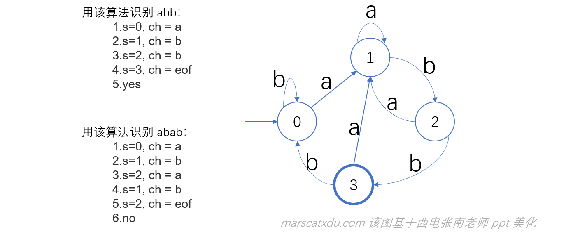

# 编译原理笔记3：有限自动机

有限自动机分为：不确定有限自动机、确定有限自动机

自动机也叫 FA（Finite Automation），FSA（Finite State Automation）

### 不确定有限自动机（NFA）

#### NFA的定义

NFA 是个五元组：M=(S, Σ, move, s0, F)。(M：machine）

1. S 是有限个 state 的集合；

2. Σ 是有限个输入字符的集合（包括 ε，也就是字母表）；

3. move 是状态转移函数 move(si, ch) = sj：当前状态 si 下若遇到输入字符 ch 则转移到状态sj；

   注意：实际上，这个严格来讲不应该叫函数。因为即使我们的 si、ch 都是确定的，执行该过程也未必会得到相同的 sj ！确定的输入得到确定的输出才能叫函数。

4. s0 是唯一的初态（开始状态）；

5. F 是终态**集合**（也叫做接受状态集），其为 S 的子集，包含了所有的终态。

NFA 还可以使用状态转移图、状态转换矩阵来表示。

转移图的初态用一个单独的箭头表示，终态可以用粗线条的圆圈也可以用两层圆圈

图的关系可以使用矩阵表示。因此我们可以构造这样一个状态转移矩阵。在这个矩阵中： i 状态接受 b 能跳到 j 状态。

如果在 1 这里接收到了 a ，那就说明出错了，需要到出错处理。也可以专门为错误的跳转增加一个“死状态”。如果一个输入的串尝试了所有可能的路径，最后的结果是朝着未定义的方向跳过去了，那就叫做“这个串不被NFA接受”

#### NFA对记号的识别

##### 一般方法（串行）：

**【反复试探所有路径，直到到达终态，或者到达不了终态】**

简单地说，就是：要从初态开始，每接受一个字符跳一下，一条路径跳不到终态就尝试另一个。只要能跳到终态，就说明一个字符串是合法的单词，就把这个记号归入到一个记号里面了。如果无论如何都跳不到终态，那就是这个字符串不合法。

以 (a|b)*abb 的 NFA 为例：

这里存在一个问题：在 0 状态时，接收到 a 是跳 0 还是跳 1 呢？事实上，哪个都有可能——跳哪个完全是随机的。这就是**不确定性**，即在同一状态下，对同一个字符有多于一个的下一状态转移。

在这个例子中的体现，就是 abb 都跳完了，结果却有还留在 0 状态的可能性。这种情况下，把所有输入序列都走完了却还没有到达终态，所以不接受这个路径，就要尝试下一个路径——也就是说，如果选错了走不下去就要后退找另一条路。和走迷宫差不多。。要把所有的岔路都走完了才能确定能不能走下去。

每次匹配使用的是最长匹配【最长识别原则】：如果没有跳完所有的输入字符，即使中途到达了一个终态集中的状态，也不能就此返回。而应该在此之上继续根据连续的输入字符往下跳。

##### NFA 的 ε 转移也有不确定性

因为任何字符串在中间的任何位置插入一个 ε 后的值仍和原来相等（即，一个字串任何位置插入一个空字串后并不会发生改变。。听起来像废话），因此，我们对于一个可以通过 ε 跳转的边，我们可以选择在任意的时候通过这条边跳走。例如：

如图，我们可以在多个位置选择跳转 ε

#### 显然 NFA 存在严重的问题

1. 需要尝试全部的路径才能确定输入的串是否能被接受；
2. 因为要进行大量回溯，所以复杂度会提升。

因此，有了 **有限状态机**

### 确定有限自动机（DFA）

DFA 也是一种 NFA，但 DFA 要求不能有 ε 状态转移，且对每个状态 s 和每个字符 a 最多有一个下一状态。

DFA 中不存在回溯，无论接受还是不接受一个串，都只会扫描一遍。只需要扫描一次，就能确实是否接受。

对于不同的 DFA，实际使用的识别方法是相同的——无论使用什么样的 DFA 和输入序列，都是一样的要从初态开始随着输入序列去一步步转移，直到输入序列扫描完，判断到没到终态即可。

也就是说，这种识别的运行方式，与具体的 正规式（正规式决定了DFA是什么样子） 和输入序列无关，那么这种运行方式就可以被独立出来，和不同的 DFA 直接一起工作。

这种运行方式可以写成算法，这个算法就叫做”模拟器“（模拟 DFA 的行为）或”驱动器“（用 DFA 驱动的数据驱动分析动作）。算法和 DFA 放在一起，就是词法分析器的核心了，可以识别记号。这里只有 DFA 和模式是有关的，算法和模式没有任何关系。

我们在使用的时候，词法规则是要作为数据输入给算法的。

关于模式、记号、单词、词法分析器，再复读一遍。。

- 模式（Pattern）： 产生和识别元素的规则，就是定义的词法规则；
- 记号（Token）： 按照某个模式（或规则）识别出的元素（一组）。进行词法分析时，将程序转为一个个的记号，就是根据规则得到一个记号流；
- 单词（lexeme）： 被识别出的元素自身的值（一个），也称为词值。可以理解为源程序中一个个的字符串；
- 记号是一堆单词，其基本可分为：关键字、标识符、字面量、特殊符号这些。一个记号由记号的类别和记号的属性组成。比如程序中有一个变量名 myCount ，它的类别是 id，它的属性就是”myCount“；
- 语法分析器：相当于识别每个词代表什么。进行的工作就是识别单词；

源程序里面是一个个的单词，我们使用“模式”这个规则，对单词进行识别、分类，把它们放到相应的记号里面去。

对于没有下一状态转移的情况，我们可以给这个没有转移的字符增加一个死状态（就是下图的 d ），然后在死状态无论进行什么跳转都会跳回到死状态自身。

#### 有限自动机的等价

如果两个 FA 能识别同一个正规集，那么就说这两个 FA 等价。

正规式、FA 都能表示正规集——正规式能够描述正规集，而 FA 能够识别正规集。

因此，正规式和 FA 能够表示相同的正规集，这时，该正规式和 FA 就是等价的。

可能存在的等价关系：

1. 两个描述相同正规集的正规式等价；
2. 两个识别同一个正规集的NFA等价；
3. NFA、DFA 同上；
4. 其他都差不多是一个意思——两样东西能表示同一个正规集，那这两个东西就是等价的。 