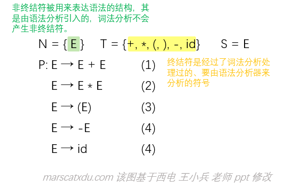
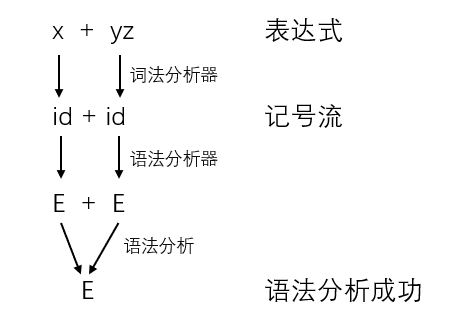

# 编译原理笔记8：语法分析（2）上下文无关文法 CFG

## CFG 概述及其四元组表示

CFG 是什么？**CFG 是描述语言语法的工具，CFG 通过推导的方式产生语言。**我们使用这个工具来对定义我们的语法，然后可以使用一些算法来基于它构造我们想要的词法分析器！这个分析器能够将我们的记号流构造为合法的语法树。

&emsp;类似于我们在这里学过的很多其他东西，CFG 也一样可以使用四元组表示：

&emsp;CFG G=(N, T, P, S)

&emsp;该四元组中的 N、T、P 都是集合，分别是 **非终结符（Nonterminals）、终结符（Terminals）、产生式（Productions）** 的集合。S（Start Symbol） 是一个较为特别的非终结符，其为文法的开始符号。

其中：

- N 和 T 没有交集；
- P 的形式是 A→a，A∈N，a∈(N∪T)*（终结符或非终结符组成的一个串），箭头左侧的被称为左部，右侧的被称为右部

<div style="box-shadow: 0 1px 4px 0 rgba(0,0,0,0.2);
            transition: 0.2s;
            border-radius:5px;
            padding:15px;
            color: gray;
            argin:3px 5px 8px 5px">
	与 CFG 相对的，还有一种文法叫做“上下文有关文法”即 CSG（Context Sensitive Grammar），
    <div style="border-style: dashed; 
            border-radius:5px; 
            padding:15px; 
            margin:3px 5px 8px 5px; 
            border-width: 1px; 
            border-color: grey">
        int i;<br>
        i = 10;	// 这就叫CSG，下面 i 的值要和上面声明的相关<br><br>
        下面这种就是 CFG：<br>
        int i;<br>
        i = "abc";
    </div>
    然而，CFG 也可以使用符号表来处理上下文有关的情况。例如，当我们读到 "int i;" 时，就将 i 放入符号表中存储下来，当我们后面遇到 "i=10;" 时，就要到符号表中查找是否有已经声明过的 i 存在。注意，这种处理上下文有关的方式不属于语法分析的方法。
</div>


例子：简单的算术表达式的 CFG 表示：

<div style="padding:0px 20% 0px 20%;
            margin:3px 5px 8px 5px">
	
</div>

产生式中的  “ → ”  读作“定义为” / “导出为”，例如 “ E→E+E ” 读作 “E 导出为 E+E”，其表示 “算术表达式定义为两个算术表达式相加”。

注意，CFG 一旦定义完成，语法也随之定义完成了。一个句子是否语法合法，就要看我们定义的 CFG 了。比如在上面这个例子的语法定义中，“- - - - - id” 就是一个合法的句子，而 “ id - id ” 却不合法，若想要其合法，需要在产生式中追加 “ E→ E - E ” 。 

<div style="padding:0px 20% 0px 20%;
            margin:3px 5px 8px 5px">
	
</div>

## 产生式集合表示 CFG

然而 CFG 表示四元组太麻烦，我们这里还有一个简化的表达方式——只写产生式集合，然后其他的部分我们可以通过一些预先约定好的规定来通过产生式集合求出来。就像下面这个：

```
P:	E → E + E	(1)
	E → E * E	(2)
	E → (E)		(3)
	E → -E		(4)
	E → id		(4)
```

这么表示的前提是文法正确，另做预先约定好的规定如下：

1. 文法开始符号 S 是第一个产生式的左部——这就把四元组的最后一项 S 定义出来了；

2. N 是可以出现在产生式左边符号的集合——这就把四元组的第一项 N（非终结符） 定义出来了；

3. T 是绝不出现在产生式左边的符号集合——这就把四元组第二项 P 定义出来了。
   注意，是只在右面出现的。像下面这种情况：

   ```
   E -> ID
   ID -> ab
   ```

   尽管上面的 ID 在第一行出现在了右边，到第二行却出现在左边，因此 ID 也是非终结符。在且仅在产生式右面的符号，才能叫作终结符。

因此，只要我们写出来 P ，整个四元组就都定义出来了——因为四元组中的其他三元都可以根据定义来从 P 中分类找出来

其实也可以写得更简单——就是用 | （或）符号来连接各个产生式，以省略多余的 E

比如：

```
E → E+E
	|E*E
	|(E)
	|-E
	|id
或
E → E+E|E*E|(E)|-E|id
```

这种产生式表示也被称为“巴克斯范式”，其中 → 用 ::= 表示。

这种书写方法中，**每个右部的权利是相同的**，因为当我们说“ a 或 b ”时，并没有同时表达出来 “ a 重要还是 b 重要 ”的意思，我们也不能简单地因为 a 在 b 的前面而推断 a 比 b 更重要。这里的“权利”与文法的二义性有关。

终结符与非终结符还可以用下面的不同写法进行区分：

1. 大小写区分：	E → id
2. 用双引号区分：E → "id"   E → E "+" E
3. 用尖括号区分：E → \<E> + \<E>

## CFG，用推导，产生语言

回忆正规式——写正规式的时候，就已经有“产生”的含义在里面了

在正规式的定义中，我们可以说

> a|b是一个正规式，它表示的正规集是：a表示的语言和b表示的语言做一个并

——注意看这句话——我们已经在定义正规式的时候把语言定义出来了！

但是现在写CFG的时候，我们可没有说“CFG产生的语言”这类的话。我们现在说使用推导来用CFG产生语言，就是讲CFG怎么描述这个语言。

正规式定义的时候，正规集这个语言就已经随之定义完了；但定义CFG的时候，这个语言还没定义，我们要单独考虑怎么定义语言——CFG产生语言的方式就是推导