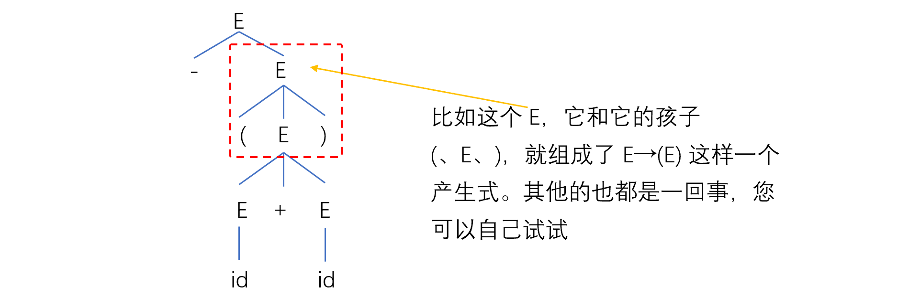
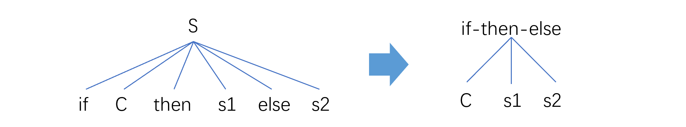

# 编译原理笔记9

**语法分析树和语法树不是一种东西**。习惯上，我们把前者叫做“具体语法树”，其能够体现推导的过程；后者叫做“抽象语法树”，其不体现过程，只关心最后的结果。

## 语法分析树

语法分析树是语言推导过程的图形化表示方法。这种表示方法反映了语言的实质以及语言的推导过程。

定义：对于 CFG G 的句型，分析树被定义为具有下述性质的一棵树：

1. 根由开始符号所标记；

2. 每个叶子由一个终结符、非终结符或 ε 标记；

3. 每个内部节点都是非终结符；

4. 若 A 是某节点的内部标记，且 X1、X2...Xn 是该节点从左到右的所有孩子的标记。则：A→X1X2...Xn 是一个产生式。若 A→ε，则标记为 A 的节点可以仅有一个标记为 ε 的孩子。若 A→ε ，则标记为 A 的节点可以仅有一个标记为 ε 的孩子。

   以 E => -E => -(E) => -(E+E) => -(id+E) => -(id+id) 为例

### 分析树与语言和文法的关系

- 每一直接推导（每个产生式），对应一颗仅有父子关系的子树，即产生式左部非终结符“长出”右部的孩子；
- 分析树的叶子，从左到右构成 CFG G 的一个句型（T、N两掺的串）。若叶子仅由终结符标记（+ 、- 、* 之类的运算符号也算是终结符），则构成一个句子。

推导，有最左推导和最右推导，这两种推导方式在推导过程中的分析树可能不同，但因最终得到的句子是相同的，所以最终的分析树是一样的。

分析树能反映句型的推导过程，也能反映句型的结构。然而实际上，我们往往不关心推导的过程，而只关心推导的结果。因此，我们要对**分析树**进行改造，得到**语法树**。语法树中全是终结符，没有非终结符。而且语法树中没有括号

## 语法树

定义：

> 对 CFG G 的句型，表达式的语法树被定义为具有下述性质的一棵树：
>
> 1. 根与内部节点由表达式中的操作符标记；
> 2. 叶子由表达式中的操作数标记；
> 3. 用于改变运算优先级和结合性的括号，被隐含在语法树的结构中。

说白了，语法树这玩意，就一句话：**叶子全是操作数，内部全是操作符**，树里没有非终结符也不能有括号。

语法树要表达的东西，是操作符（运算）作用于操作数（运算对象）

举俩例子吧：

【例】： -(id+id) 的语法树：

【例】：-id+id 的语法树：

显然，我们从上面这两个语法树中，直接就能观察出来它们的运算顺序。

【例】：句型 if C then s1 else s2

if-then-else 是个终结符，其是一整个操作符。该操作符有三个操作数：条件 C、真分支 s1、假分支 s2

## 二义性及二义性的消除

### 二义性问题

**二义性问题：一个句子可能对应多于一棵语法树。**

【例】： 设文法 G： E → E+E | E*E | (E) | -E | id

则，句子 id+id*id、id+id+id 可能的分析树有：

在该例中，虽然 id+id+id 的 “+” 的结合性无论左右都不会影响结果。但万一，万一“+”的含义变成了“减法”，那么左结合和右结合就会引起很大的问题了。

我们在这里讲的“二义性”的“义”并非语义——我们现在在学习的内容是“语法分析器”，尚未到需要研究语言背后含义的阶段。

- “语法”分析的任务，是确定 “E+E” 这么写是否合法；
- “语义”分析的任务，是确定 “+” 这个符号到底蕴含着什么信息，即，该怎么解释这个符号。

我们现在讲的“二义性”指的是一个句子对应多种分析树。

### 优先级、结合性：引起二义性的根本原因

二义性的体现，是文法对同一句子有不止一棵分析树。这种问题由【句子产生过程中的某些推导有多于一种选择】引起。