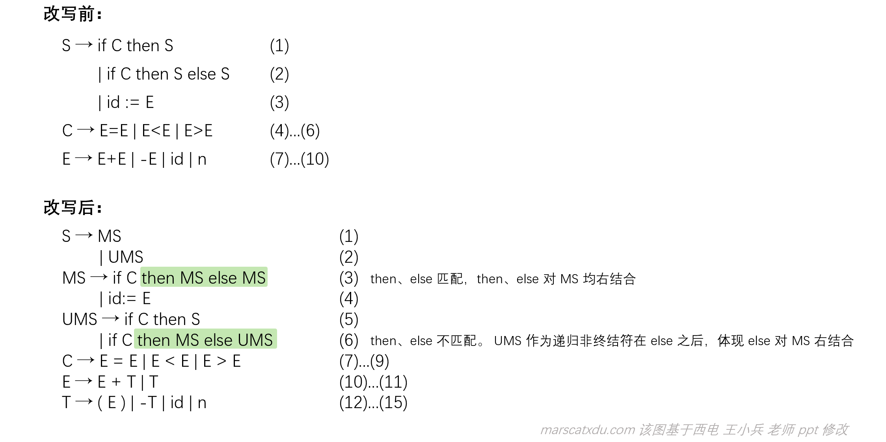

# 编译原理笔记9：语法分析树、语法树、二义性的消除

**语法分析树和语法树不是一种东西**。习惯上，我们把前者叫做“具体语法树”，其能够体现推导的过程；后者叫做“抽象语法树”，其不体现过程，只关心最后的结果。

## 语法分析树

语法分析树是语言推导过程的图形化表示方法。这种表示方法反映了语言的实质以及语言的推导过程。

定义：对于 CFG G 的句型，分析树被定义为具有下述性质的一棵树：

1. 根由开始符号所标记；

2. 每个叶子由一个终结符、非终结符或 ε 标记；

3. 每个内部节点都是非终结符；

4. 若 A 是某节点的内部标记，且 X1、X2...Xn 是该节点从左到右的所有孩子的标记。则：A→X1X2...Xn 是一个产生式。若 A→ε，则标记为 A 的节点可以仅有一个标记为 ε 的孩子。

   以 E => -E => -(E) => -(E+E) => -(id+E) => -(id+id) 为例


### 分析树与语言和文法的关系

- 每一直接推导（每个产生式），对应一仅有父子关系的子树，即产生式左部非终结符“长出”右部的孩子；
- 分析树的叶子，从左到右构成 CFG G 的一个句型（T、N两掺的串）。若叶子仅由终结符标记（+ 、- 、* 之类的运算符号也算是终结符），则构成一个句子。

推导，有最左推导和最右推导，这两种推导方式在推导过程中的分析树可能不同，但因最终得到的句子是相同的，所以最终的分析树是一样的。

分析树能反映句型的推导过程，也能反映句型的结构。然而实际上，我们往往不关心推导的过程，而只关心推导的结果。因此，我们要对**分析树**进行改造，得到**语法树**。语法树中全是终结符，没有非终结符。而且语法树中没有括号

## 语法树

定义：

> 对 CFG G 的句型，表达式的语法树被定义为具有下述性质的一棵树：
>
> 1. 根与内部节点由表达式中的操作符标记；
> 2. 叶子由表达式中的操作数标记；
> 3. 用于改变运算优先级和结合性的括号，被隐含在语法树的结构中。

说白了，语法树这玩意，就一句话：**叶子全是操作数，内部全是操作符**，树里没有非终结符也不能有括号。

语法树要表达的东西，是操作符（运算）作用于操作数（运算对象）

举俩例子吧：

【例】： -(id+id) 的语法树：


【例】：-id+id 的语法树：


显然，我们从上面这两个语法树中，直接就能观察出来它们的运算顺序。

【例】：句型 if C then s1 else s2


if-then-else 是个终结符，其是一整个操作符。该操作符有三个操作数：条件 C、真分支 s1、假分支 s2

## 二义性及二义性的消除

### 二义性问题

**二义性问题：一个句子可能对应多于一棵语法树。**

【例】： 设文法 G： E → E+E | E*E | (E) | -E | id

则，句子 id+id*id、id+id+id 可能的分析树有：


在该例中，虽然 id+id+id 的 “+” 的结合性无论左右都不会影响结果。但万一，万一“+”的含义变成了“减法”，那么左结合和右结合就会引起很大的问题了。

我们在这里讲的“二义性”的“义”并非语义——我们现在在学习的内容是“语法分析器”，尚未到需要研究语言背后含义的阶段。

- “语法”分析的任务，是确定 “E+E” 这么写是否合法；
- “语义”分析的任务，是确定 “+” 这个符号到底蕴含着什么信息，即，该怎么解释这个符号。

我们现在讲的“二义性”指的是一个句子对应多种分析树。

### 优先级、结合性：引起二义性的根本原因

二义性的体现，是文法对同一句子有不止一棵分析树。这种问题由【句子产生过程中的某些推导有多于一种选择】引起。悬空 else 问题就可以很好地体现这种【超过一种选择】带来的二义性问题，示例如下。

#### 【悬空（dangling）else】 问题

看下面这么个例子。。


（其实，我感觉这个其实比较像是“说话大喘气”带来的理解歧义问题。。。）上面的产生式中并没体现出来该咋算分一块，所以两种完全不同的句子结构都是合法的。

### 二义性的消除

二义性问题是有救的，大概有以下这三种办法：

1. 将二义文法改成非二义文法；
2. 规定二义文法中符号的优先级和结合性；
3. 改变语言的结构或书写方式。

这些办法的核心，其实都是将优先级和结合性说明白。

#### 1. 改写二义文法为非二义文法

**核心：把优先级和结合性说明白**

既然要说明白，那就不能让一个非终结符可以直接在当次推导中能推出会带来优先级和结合性歧义的东西。（对分析树的一个内部节点，不会有出现在其下面的分支是相同的非终结符的情况。如果有得选，那就有得歧义了。没得选才能确定地一路走到黑）

改写为非二义文法的二义文法大概有下面这几个特点：

- 需要引入新的终结符，且新引入的非终结符，能够限制每一步推导都只有唯一的选择；
- 引入新的非终结符后，推到步骤会增多（分析树增高）；
- 越接近 S 的文法符号优先级越低（重要！！）；
- 对于 A → αAβ，若 A 在终结符左侧出现（即终结符在 β 中），则 A 产生式具有左结合性；
- 在语法树中，越在分析树底下的运算符号越先被计算（即，离开始符号越远的越先算）。

**改写的关键步骤：**

1. 引入新的非终结符，增加一个子结构并提高一级优先级；
2. 若要运算有左结合性，需要让递归非终结符在终结符左边。相对的，递归非终结符在右边则会让运算右结合。

【例】改写下面的二义文法为非二义文法。图右侧是要达成的优先级和结合性


改写的核心其实就两句话：

1. 要引入新的优先级，就需要引入新的非终结符，且距离 S 越近的文法符号优先级越低；
2. 递归非终结符在终结符左边，运算就左结合，反之亦。

所以能够得到非终结符与运算的对应关系（因为不同的运算有不同的优先级，我们想要引入多个优先级就要引入多个新的非终结符。这样每个非终结符就可以负责一个优先级的运算符号，也就是说新的非终结符是与运算有关系的了。因此这里搞出来了“对应关系”四个字）如下：


优先级由低到高分别是 +、\*、-，而距离开始符号越近，优先级越低。因此在这里的排序也可以+\*-顺序。每个符号对应一层的非终结符。根据所需要的结合性，则可确定是左递归还是右递归，以确定新的产生式长什么样子


【例】：规定优先级和结合性，写出改写的非二义文法


##### 让我们来搞【悬空 else 】罢！

我们已经掌握了一种叫做【改写】的工具，能让我们消除二义性。接下来我们就要用这个工具来尝试搞搞悬空 else 问题！

悬空 else 问题出现的原因是 then 数量多于 else，让 else 有多个可以结合的 then。在二义文法中，由于选哪两个 then、else 配对都可以，故会引起出现二义的情况。在这里，我们规定 else 右结合，即与左边最靠近的 then 结合。

为改写此文法，可以将 S 分为完全匹配（MS）和不完全匹配（UMS）两类。在 MS 中体现 then、else 个数相等即匹配且右结合；在UMS 中 then、else 不匹配，体现 else 右结合。



例：用改写后的文法写一个条件语句


经过检查，无法再根据文法写出其他分析树，故已经消除了二义性

#### 2. 规定优先级和结合性

虽然二义文法会导致二义性，但是其并非一无是处。其有两个显著的优点：

1. 比非二义文法容易理解；
2. 分析效率高（分析树高度低，直接推导的步骤少）。

在 Yacc 中，我们可以直接指定优先级、结合性而无需自己重写文法。

```yacc
  %left '+'
  %left '*'
  %right '-'
```

left 表示左结合，right 表示右结合。越往下的算符优先级越高。

嗯就这么简单。。。

#### 3. 修改语言的语法

我们其实可以把语言本身定义成没有优先级和结合性的。。然后所有的优先、结合都交由括号进行控制，哪个先算就加括号。把一个过程的结束用明确的标志标记出来。

比如在 Ada 中：

```Ada
if x<3 then 
	if x>0 then 
		x:= 5; 
	end if;
	else x:= -5;
end if;
```

在 Pascal 中，给表达式加括号：

```pascal
(a+b)>(c*d)
```

